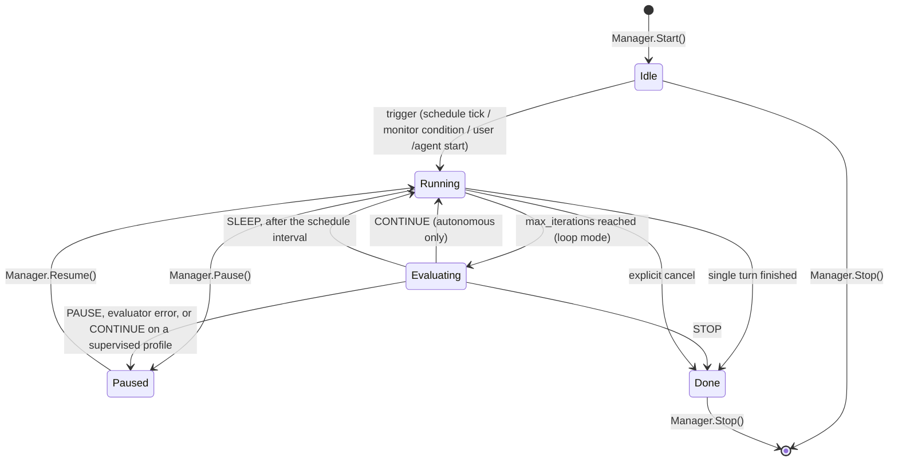
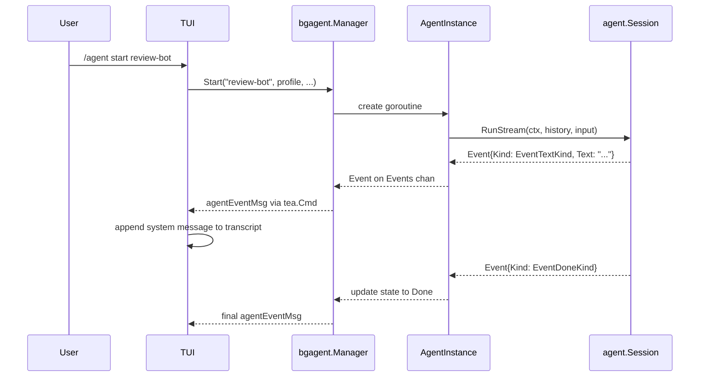

# Agent Profiles

Agent profiles are named, reusable agent definitions stored on disk under
`~/.vulnetix/signet/profiles/agents/`. They are richer than the flat prompt
profiles used by `/profile`: each profile defines a system prompt, a tool
allow-list, an operating mode, and an autonomy level.

The directory is `agentprofile.Dir()` — `config.GlobalDir()/profiles/agents`,
where `GlobalDir()` honours `SIGNET_HOME` and otherwise resolves to
`~/.vulnetix/signet`.

## Profile schema

```json
{
  "name": "review-bot",
  "description": "Reviews open PRs for style issues",
  "system_prompt": "You are a code-review bot...",
  "tools": ["Read", "Bash", "Grep"],
  "mode": "loop",
  "schedule": "0 9 * * MON",
  "monitor_condition": "git status shows uncommitted changes",
  "reflection": true,
  "max_iterations": 5,
  "autonomy": "supervised",
  "provider": "llama-server",
  "model": "default",
  "effort": "low",
  "guardrails": true,
  "ask_permission": false
}
```

### Fields

| Field | Required | Type | Description |
| ----- | -------- | ---- | ----------- |
| `name` | Yes | string | Unique identifier, used with `/agent start <name>`. |
| *(file name)* | No | string | The on-disk filename (e.g. `triage-deps.json`), independent of `name`. It is never serialised — the file's own name is the record. Empty means derive it from `name`. The editor exposes it as its own field; renaming via `name` moves the file only while the file name is still derived. |
| `description` | Yes | string | Human-readable purpose, shown in `/agent list`. |
| `system_prompt` | Yes | string | The system prompt sent to the model on every turn. |
| `tools` | No | string[] | Allowed tool names; empty means the full default registry. Validated against the built-in set: `Bash`, `Cd`, `Edit`, `ExitPlanMode`, `Glob`, `Grep`, `Read`, `ReadSession`, `SearchMemory`, `SearchSessions`, `SubAgentLog`, `update_plan`, `WebFetch`, `WebSearch`, `Write`. |
| `mode` | Yes | string | One of `single`, `loop`, `scheduled`, `monitor`. |
| `schedule` | No | string | Cron-like schedule expression (used when `mode` is `scheduled`). |
| `monitor_condition` | No | string | Human-readable trigger condition (used when `mode` is `monitor`). |
| `reflection` | No | bool | When true, the model is asked to emit `<thinking>` or a `reflection` field before acting. |
| `max_iterations` | No | int | Per-run iteration bound; defaults to the global `resilience.max_iterations` setting (10). |
| `autonomy` | No | string | `supervised` (default) or `autonomous`. Both execute tools during a turn; the field decides only what happens when a `loop`-mode agent exhausts `max_iterations` and the evaluator returns `CONTINUE`. An autonomous profile resets the budget and continues; a supervised one is paused instead, so unattended unbounded tool use needs the explicit opt-in. |
| `provider` | No | string | Model provider to use for this agent. Must be a built-in provider name or a configured custom-provider name. Omitted means inherit the session provider. A profile may only *name* a provider; it may never define one (no API key exfiltration). |
| `model` | No | string | Model id to use for this agent. Applies to `provider` when set, otherwise to the session provider. Omitted means inherit the session/model default (`run.DefaultModel`). |
| `effort` | No | string | Reasoning-effort hint: one of `low`, `medium`, `high`, `none`. Ignored by providers that do not support effort. Omitted means inherit the session setting. |
| `guardrails` | No | bool | When set, overrides the guardrails switch for this agent. `true` enforces the default posture; `false` ignores every gate. Omitted means inherit `settings.guardrails`. |
| `ask_permission` | No | bool | When set, overrides the permission-ask gate for this agent. `true` asks before mutating; `false` treats every permission decision as allow. Omitted means inherit `settings.ask_permission`. |

### Validation rules

- `name` must be non-empty and filesystem-safe (`[a-zA-Z0-9._-]+`).
- A non-empty file name must be a safe basename: non-empty, ending in `.json`, with no path separators, and with a stem unchanged by the name sanitiser. It may not collide with a built-in's on-disk file name.
- `mode` must be one of the four known values.
- Every entry in `tools` must exist in the default tool registry.
- `autonomy` must be `supervised` or `autonomous`.
- `schedule` is required when `mode` is `scheduled`; ignored otherwise.
- `monitor_condition` is required when `mode` is `monitor`; ignored otherwise.
- `effort` must be one of `low`, `medium`, `high`, `none` when set.
- `provider` must be a built-in provider name or a valid custom-provider name when set; profiles may *name* providers but never define them.
- A profile that sets `guardrails: false`, `autonomy: autonomous`, a looping mode (`loop`, `scheduled`, `monitor`), and omits `max_iterations` is rejected. Unattended, unbounded, and unguarded is three relaxations stacked, which is too many for a single definition.

## Background agent lifecycle



`Manager` exposes exactly `Start`, `Stop`, `Pause`, `Resume`, `List`, and
`Lookup`. There is no reset: a finished agent is stopped and started again.

### State descriptions

| State | Meaning |
| ----- | ------- |
| `Idle` | Agent is loaded but not executing; waiting for a trigger. |
| `Running` | Agent turn(s) are active in a goroutine. |
| `Paused` | Agent was running and is temporarily suspended. Its goroutine is alive and blocked; its events channel stays open. |
| `Done` | Agent completed its work (loop evaluator `STOP`, single turn finished, or cancel). |

`Pause` is only valid from `Running` and `Resume` only from `Paused`; either
call on an agent in the wrong state returns an error rather than changing it.
The loop observes the state at its next boundary and blocks on a per-instance
buffered resume channel, so `Pause` never waits for the model and `Resume`
never blocks the UI. A spurious wake is harmless: the loop re-checks the state
after waking.

A paused agent is deliberately **not** marked `Done` when its goroutine's
deferred cleanup runs — closing its events channel would make `Resume`
impossible. Only a natural exit or an explicit stop marks it done.

### Loop mode and the agent evaluator

`loop` mode is not bounded by `max_iterations`; that value is the *inner*
budget. When the inner budget is exhausted, the agent-loop evaluator is asked
what to do next (see [role-manager.md](role-manager.md), "Agent-loop
evaluator"): `CONTINUE` resets the inner budget, `SLEEP` waits one `schedule`
interval and resets it, `PAUSE` suspends until `/agent resume`, and `STOP`
ends the loop.

Two safeguards bound this:

- A **supervised** profile that receives `CONTINUE` is paused instead.
  Unattended unbounded tool use is what `supervised` exists to prevent, so a
  classifier can never grant autonomy the profile was not given.
- A malformed or unreachable evaluator fails closed to `PAUSE` — stop spending
  tokens, wait for the user.

### Reflection

When `reflection` is true, every loop turn's prompt is prefixed with an
instruction to emit a `<thinking>` block before acting, so the agent's
reasoning is visible in the transcript ahead of any tool call.

### Per-turn output isolation

`lastOutput` is reset before each turn, not only assigned on success. A turn
ending in an error event never reaches the assignment, so without the reset the
previous turn's reply would be carried forward and appended to `History` a
second time. A bounded loop hid that; a restarting one compounds it every pass.

### TUI commands

| Command | Effect |
| ------- | ------ |
| `/agent` | Open the agent picker to choose a profile for agent-mode turns |
| `/agent create <name>` | Design and save a new agent profile named `<name>`; the builder runs visibly behind an activity row and a composer phase |
| `/agent edit <name>` | Open an existing profile in the agent editor |
| `/agent list` | Show every discovered profile, its file path, and any running state |
| `/agent start <name>` | Start the agent and stream its events into the transcript |
| `/agent pause <name>` | Suspend a running loop-mode agent at its next boundary |
| `/agent resume <name>` | Wake a paused agent and re-attach its event stream |
| `/agent stop <name>` | Cancel the agent's context and close it out |
| `/agent log <name>` | Show the agent's recent events |

In the list view, `↑`/`↓` selects a profile, `enter` or `e` opens the editor, `n`
creates a new agent from a valid stub, `d` duplicates the selected agent, and
`esc` returns to chat. The editor exposes every `AgentProfile` field — name,
file name, description, system prompt, tools, mode, schedule, monitor condition,
provider, model, effort, autonomy, guardrails, ask permission, reflection, and
max iterations — grouped into identity, behaviour, model and safety sections.

Choose and toggle fields are cycled with `space`, `enter`, `←` or `→`; text
fields open an inline editor and commit with `enter`; the system prompt is a
multiline editor (`ctrl+j` inserts a newline, `e` opens `$VISUAL`/`$EDITOR`);
and tools opens a multi-select picker (`space` toggles, `a` all, `n` none,
`enter` commits the sorted selection). `schedule` and `monitor condition` show
a muted `required` marker when the current mode demands them.

Built-in `signet:` profiles are read-only in the editor; any mutating key shows
`built-in profile is read-only — d duplicates it`. Pressing `d` strips the
`signet:` prefix, clears the built-in and file-name state, saves an editable
copy, and opens it. After `/agent create` the new profile is selected and the
editor opens automatically.

## Event flow



Background agents run in their own goroutines so the user's main session is
never blocked. Events are forwarded into the TUI update loop through
`agentEventMsg` so the main transcript can show progress and results.

## Storage namespace

User-built agents live under `~/.vulnetix/signet/profiles/agents/` to avoid
clashing with the flat `profiles/` namespace used by `/profile`. The two
namespaces are disjoint; no migration is required. Setting `SIGNET_HOME` moves
both.

## Running a definition in the foreground

A definition is not only a background agent. The agent picker above the
composer (see [architecture.md](architecture.md), "Agent picker") lists both
trees, marking definitions from this one with `↻`, and offers two verbs:

| Key | Effect |
| --- | ------ |
| `enter` / `right` | Engage the definition for the session's agent-mode turns: its `system_prompt` becomes the system prompt's carrier block and its `tools` allow-list narrows the session registry, the same narrowing `Manager.buildSession` applies. `mode`, `schedule`, `monitor_condition`, `reflection` and `max_iterations` are loop settings and do not apply in the foreground. When `enter` had opened the picker over a non-empty composer, engaging also sends that prompt. |
| `ctrl+g` | Start it as a background agent, exactly as `/agent start <name>` does. It does not touch the prompt in the composer. |

The picker is opened with `/agent` (no argument) or by pressing `enter` in
agent mode while no agent is engaged. `@agent:<name>` no longer opens the
picker in the TUI; it is now a prompt-level directive interpreted by the role
manager, or a literal file-chooser filter if typed at the end of a line.

The two openings differ in one way only: the `enter` opening carries a
**pending submit**, so choosing a carrier finishes the turn the user asked
for. The `/agent` opening never does — a prompt being drafted in the composer
is not a submit, so engaging an agent there leaves it alone. Choosing
`(none)`, or pressing `esc`, discards the pending submit rather than sending
a turn with no carrier.

## Per-agent defaults and precedence

An agent profile is the third layer of the posture and model configuration
stack. Highest precedence wins:

```
CLI flag  >  live TUI toggle (f3/f4, /yolo)  >  agent profile  >  settings.json  >  state.json  >  defaults
```

- **CLI flags** (`--guardrails`, `--ask-permission`, `--provider`, `--model`,
  `--effort`) override everything.
- **Live toggles** (`f3`, `f4`, `/yolo`) override the profile and settings.
- **Agent profile** fields (`provider`, `model`, `effort`, `guardrails`,
  `ask_permission`) override `settings.json` and `state.json` for the running
  agent session, but they are themselves overridden by any explicit operator
  toggle or CLI flag.
- For posture, the project posture floor is applied after the profile value,
  so a profile can loosen settings but cannot loosen the project's own
  `postures:` preference.

A profile that lowers `guardrails` or `ask_permission` is announced in the
transcript and traced under `SIGNET_TRACE` (`profile_posture_drop`) so an
unattended posture drop is never silent.

Engaging resolves through `agent.CarrierOptions`, which tries
`profiles.Load` first and falls back to `agentprofile.Load` — so
`@agent:<name>` and `/profile <name>` still reach these definitions. A flat
profile owns a shared name, and the picker drops the shadowed definition
rather than offering a row that would engage the other file.

## Hermes-style builder

The agent builder wizard (`/agent create`) uses the configured LLM provider
with a dedicated system prompt (the "agent designer") to generate profile
JSON. The model is instructed to emit structured reasoning (`<thinking>` or a
JSON `reflection` field) before the final profile, encouraging explicit
tool-allowlist justification and self-correction.

The builder feeds validation errors back to the model in a retry loop bounded
by `MaxAttempts`. Validation errors are sanitized before being sent back. The
classifier turn carries no tools, skills, or agent block, preserving existing
security invariants.

`/agent create <name>` is name-first: the name is validated locally before any
classifier round trip, the design work runs behind a `Silent` activity row
(`agent design: <name>` in f9, cancelled with `x`) and a composer phase with a
live spinner, and the builder's `OnAttempt` progress is appended to the activity
so f9 shows `attempt 2/3: validation error: …`. After `Build` returns, the
profile's `Name` is forced back to the requested name before save, so the LLM
can design the fields but never rename the user's profile. On failure a valid
stub is saved and the editor still opens, so the user is never dropped back to
chat with nothing.
