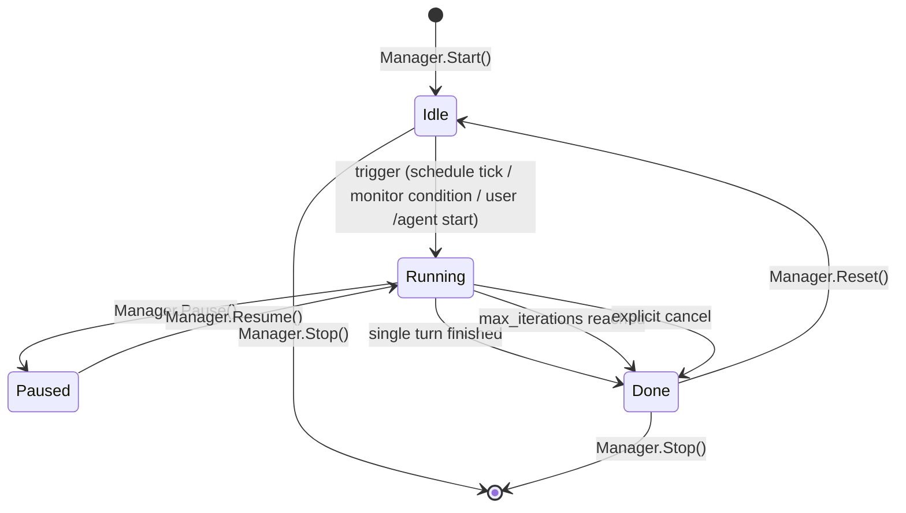
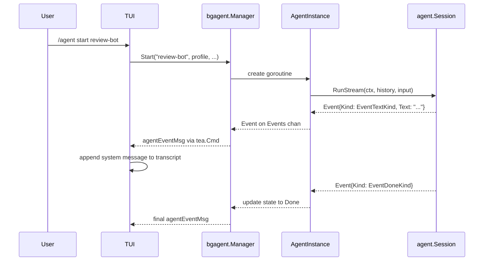

# Agent Profiles

Agent profiles are named, reusable agent definitions stored on disk under
`~/.signet/profiles/agents/`. They are richer than the flat prompt profiles
used by `/profile`: each profile defines a system prompt, a tool allow-list,
an operating mode, and an autonomy level.

## Profile schema

```json
{
  "name": "review-bot",
  "description": "Reviews open PRs for style issues",
  "system_prompt": "You are a code-review bot...",
  "tools": ["Read", "Bash", "Grep"],
  "mode": "loop",
  "schedule": "0 9 * * MON",
  "monitor_condition": "git status shows uncommitted changes",
  "reflection": true,
  "max_iterations": 5,
  "autonomy": "supervised"
}
```

### Fields

| Field | Required | Type | Description |
| ----- | -------- | ---- | ----------- |
| `name` | Yes | string | Unique identifier, used with `/agent start <name>`. |
| `description` | Yes | string | Human-readable purpose, shown in `/agent list`. |
| `system_prompt` | Yes | string | The system prompt sent to the model on every turn. |
| `tools` | No | string[] | Allowed tool names; empty means the full default registry. |
| `mode` | Yes | string | One of `single`, `loop`, `scheduled`, `monitor`. |
| `schedule` | No | string | Cron-like schedule expression (used when `mode` is `scheduled`). |
| `monitor_condition` | No | string | Human-readable trigger condition (used when `mode` is `monitor`). |
| `reflection` | No | bool | When true, the model is asked to emit `<thinking>` or a `reflection` field before acting. |
| `max_iterations` | No | int | Per-run iteration bound; defaults to the global `resilience.max_iterations` setting (10). |
| `autonomy` | No | string | `supervised` (default) or `autonomous`. Supervised agents surface events in the TUI but do not execute tools without user confirmation. Autonomous mode requires an explicit posture opt-in. |

### Validation rules

- `name` must be non-empty and filesystem-safe (`[a-zA-Z0-9._-]+`).
- `mode` must be one of the four known values.
- Every entry in `tools` must exist in the default tool registry.
- `autonomy` must be `supervised` or `autonomous`.
- `schedule` is required when `mode` is `scheduled`; ignored otherwise.
- `monitor_condition` is required when `mode` is `monitor`; ignored otherwise.

## Background agent lifecycle



### State descriptions

| State | Meaning |
| ----- | ------- |
| `Idle` | Agent is loaded but not executing; waiting for a trigger. |
| `Running` | Agent turn(s) are active in a goroutine. |
| `Paused` | Agent was running and is temporarily suspended. |
| `Done` | Agent completed its work (single turn, max iterations, or cancel). |

## Event flow



Background agents run in their own goroutines so the user's main session is
never blocked. Events are forwarded into the TUI update loop through
`agentEventMsg` so the main transcript can show progress and results.

## Storage namespace

User-built agents live under `~/.signet/profiles/agents/` to avoid clashing
with the flat `profiles/` namespace used by `/profile`. The two namespaces
are disjoint; no migration is required.

## Hermes-style builder

The agent builder wizard (`/agent create`) uses the configured LLM provider
with a dedicated system prompt (the "agent designer") to generate profile
JSON. The model is instructed to emit structured reasoning (`<thinking>` or a
JSON `reflection` field) before the final profile, encouraging explicit
tool-allowlist justification and self-correction.

The builder feeds validation errors back to the model in a retry loop bounded
by `MaxAttempts`. Validation errors are sanitized before being sent back. The
classifier turn carries no tools, skills, or agent block, preserving existing
security invariants.
