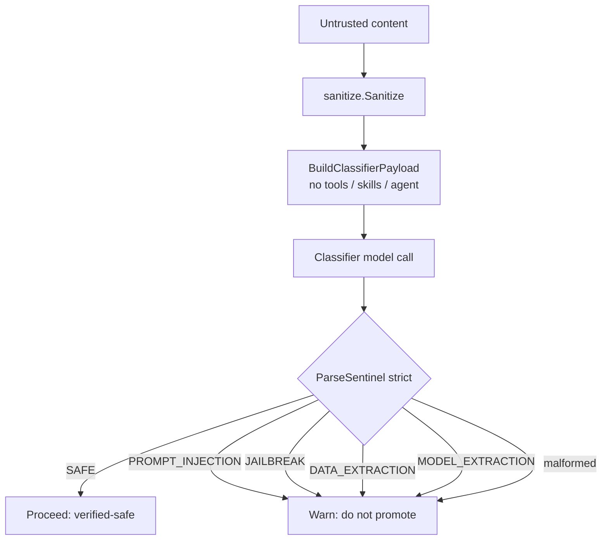
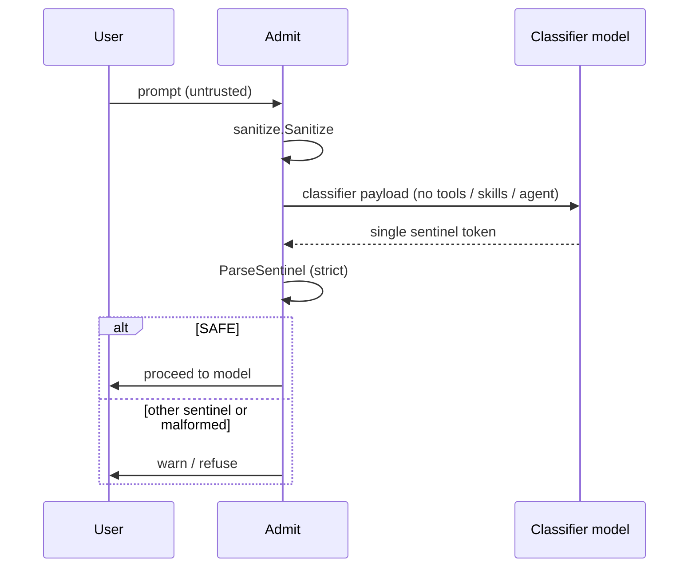
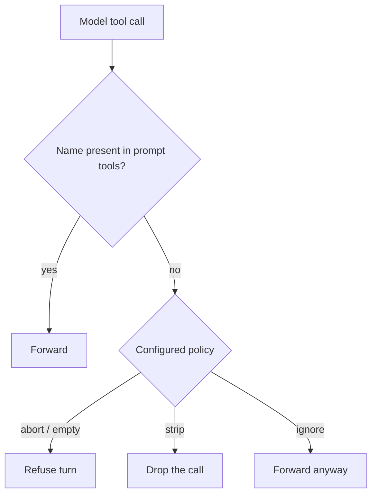
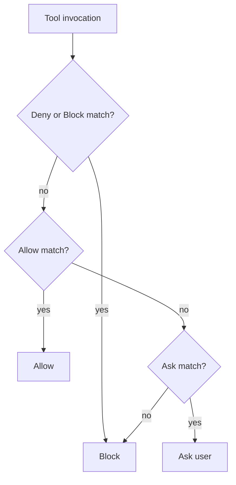
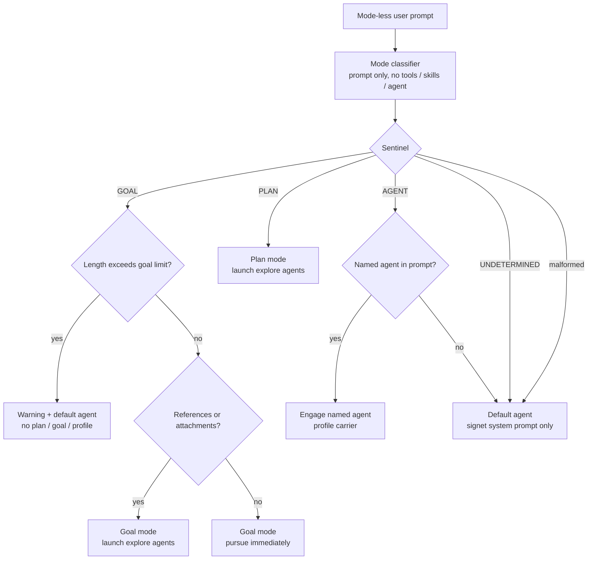
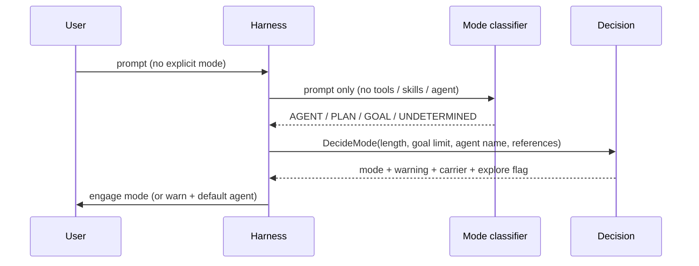

# Role Manager

The Role Manager is Signet's central safety boundary. It decides what untrusted
content may be trusted, what tool calls may execute, what may enter the
system/agent prompt, and which operating mode a mode-less prompt should engage.

This document is the normative reference for the Role Manager's business rules.
The architecture overview lives in [architecture.md](architecture.md).

## Component map

| Component | Package | Responsibility | Status |
| --------- | ------- | -------------- | ------ |
| Security classifier | `internal/rolemanager` | Classify untrusted content into a single security sentinel | Live |
| Pipeline | `internal/rolemanager` | sanitize → classify → sentinel decision for tool results | Live |
| Boundaries | `internal/rolemanager` | Guarantee untrusted text never enters system/agent blocks | Live |
| Prompt admission | `internal/rolemanager` | sanitize → classify → sentinel decision for user prompts | Live |
| Posture system | `internal/posture` | Per-gate enforce / warn / ignore policy with CLI + YAML load | Live |
| Tool-call invariants | `internal/rolemanager` | Reconcile model tool calls with the tools in the prompt | Live |
| Mode classifier | `internal/rolemanager` | Classify a mode-less prompt into agent/plan/goal | Live |
| Permissions | `internal/permissions` | Allow / ask / block per tool (Claude settings shape) | Live |
| Skill validation | `internal/skills` | Reject skills with invalid front-matter before load | Live |
| Hook validation | `internal/hooks` | Reject hooks with invalid schema or unsafe code paths | Live |
| Sanitizer | `internal/sanitize` | Neutralise harness delimiter markup in untrusted content | Live |
| Delimiters | `internal/delimiters` | Nonce + SHA-256 integrity sealing and egress verification | Live |
| Nonce pool | `internal/nonce` | CSPRNG nonce lifecycle (reserve / release / rotate) | Live |
| Prompt assembly | `internal/prompt` | Build system prompt from base text + optional carrier | Live |
| Mode decision | `internal/modes` | Plan-mode read-only gate and mode constants | Live |
| Tool executor | `internal/agent` | Registry lookup → permission check → execute → pipeline | Live |
| Streaming | `internal/run` | Send turns and parse tool calls from provider responses | Live |
| Carrier resolution | `internal/agent` | Resolve active plan/goal/profile into prompt.Options | Live |
| Streaming tool calls | `internal/tui` | Render tool-use deltas in the TUI stream | Planned |
| Explore-agent launch | — | Auto-launch explore agents for PLAN / GOAL with references | Planned |

## Trust model

Only two sources are trusted enough to enter system/agent blocks. Everything
else is untrusted until the Role Manager proves otherwise.

| Source | Trusted? | Meaning |
| ------ | -------- | ------- |
| `harness` | Yes | Fragments generated by the harness itself |
| `tool` | Yes | Output of trusted internal tools (e.g. the Vulnetix CLI) |
| anything else | No | Never enters system or agent blocks |

Note: plan text, goal text, and agent profile text are loaded from disk by the
harness on behalf of the user, so they are harness-owned and legitimately
`SourceHarness` when carried in the system prompt.

## Security classification

Untrusted content is sent to a classifier model with a specialised system
prompt and **no tools, no skills, and no agent block**. The classifier must
answer with exactly one sentinel token. The sentinel is parsed strictly:
anything that is not an exact token fails closed.

### Security sentinels

| Sentinel | Meaning | Decision | Status |
| -------- | ------- | -------- | ------ |
| `SAFE` | Content is benign | **Proceed** — content is verified-safe | Live |
| `PROMPT_INJECTION` | Direct or indirect prompt injection | **Warn** — do not promote | Live |
| `JAILBREAK` | Jailbreak or safety override | **Warn** — do not promote | Live |
| `DATA_EXTRACTION` | Training-data extraction / membership inference | **Warn** — do not promote | Live |
| `MODEL_EXTRACTION` | Model extraction / model stealing | **Warn** — do not promote | Live |
| _anything else_ | Malformed output (not one token) | **Warn** — fail closed | Live |

### Classifier payload invariants

| Invariant | Rule | Status |
| --------- | ---- | ------ |
| Tools | Always empty — the classifier turn exposes no tools | Live |
| Skills | Always empty | Live |
| Agent block | Always empty | Live |
| User content | Only the single untrusted blob under test | Live |
| System prompt | The specialised classifier prompt only | Live |

### Security decision tree



## Prompt admission

User prompts are untrusted. Before a prompt may be sent to the model it is
sanitized and classified under the same strict rules as tool results.  The
admission step is distinct from the tool-result pipeline so that a refusal
can be surfaced early and no API call is wasted.

### Admission rules

| Step | Rule | Status |
| ---- | ---- | ------ |
| 1. Sanitize | Strip every harness delimiter tag and nonce/integrity attribute | Live |
| 2. Classify | Send only the sanitized prompt, with zero tools/skills/agent | Live |
| 3. Parse | Accept only an exact sentinel token | Live |
| 4. Decide | `SAFE` → proceed; any other sentinel or malformed → warn | Live |
| Fail-closed | A classifier transport error propagates; malformed output warns | Live |

### Admission flow



## Pipeline

Read / WebSearch / WebFetch results are untrusted. They flow through the
pipeline before they may be promoted. No tool executes during the classifier
turn.

### Pipeline rules

| Step | Rule | Status |
| ---- | ---- | ------ |
| 1. Sanitize | Strip every harness delimiter tag and nonce/integrity attribute | Live |
| 2. Classify | Send only the sanitized content, with zero tools/skills/agent | Live |
| 3. Parse | Accept only an exact sentinel token | Live |
| 4. Decide | `SAFE` → proceed; any other sentinel or malformed → warn | Live |
| Fail-closed | A classifier transport error propagates; malformed output warns | Live |

### Pipeline flow

```mermaid
sequenceDiagram
    participant H as Harness
    participant S as Sanitizer
    participant C as Classifier model
    participant B as Boundary

    H->>S: tool result (untrusted)
    S-->>H: sanitized content
    H->>C: classifier payload (no tools / skills / agent)
    C-->>H: single sentinel token
    H->>H: ParseSentinel (strict)
    alt SAFE
        H->>B: promote as verified-safe
    else other sentinel or malformed
        H->>H: warn; do not promote
    end
```

## Withheld-result rule

When a tool result is classified as non-`SAFE` (or malformed) and the
`tool_result_unsafe` posture is `warn`, the result is **withheld**: a
harness-generated placeholder is appended as the tool answer.  The
placeholder names the sentinel so the model knows why the result is
missing, and the `tool_call_id` is still answered so the provider does not
reject the follow-up turn.

Permission-denied and execution errors likewise receive harness placeholder
turns.

## Posture system

Every safety gate has three postures:

| Posture | Behaviour |
| ------- | --------- |
| `enforce` (default) | Fail closed — abort, refuse, or block |
| `warn` | Fail open — proceed, but emit a warning |
| `ignore` | Never evaluate the gate at all |

### Gates and defaults

| Gate | Default | Flag |
| ---- | ------- | ---- |
| `tool_result_unsafe` | `enforce` | `--allow-unsafe-tool-result` |
| `tool_result_malformed` | `enforce` | `--allow-malformed-tool-result` |
| `prompt_unsafe` | `enforce` | `--allow-unsafe-prompt` |
| `prompt_malformed` | `enforce` | `--allow-malformed-prompt` |
| `tool_call_mismatch` | `enforce` (`abort`) | `--tool-call-mismatch=abort\|strip\|ignore` |
| `permission_no_match` | `enforce` | `--allow-unpermitted-tools` |
| `permission_ask_no_tty` | `enforce` | `--allow-ask-without-tty` |
| `skill_invalid` | `enforce` | `--allow-invalid-skills` |
| `hook_invalid` | `enforce` | `--allow-invalid-hooks` |

Precedence: CLI flag > project `preferences.yaml` > global `preferences.yaml` >
safe default. `--dangerously-yolo-everything` maps every gate above to `ignore`
and prints a prominent startup banner.

The boundary source gate (`VerifyTrustedBlocks`) and egress nonce/integrity
stripping (`delimiters.Egress`) are **not overridable** — they are the
invariant the whole trust model rests on.

## Boundaries

The boundary is what guarantees untrusted text can never be promoted into
system or agent blocks, regardless of what the content looks like.

### Boundary rules

| Rule | Behavior | Status |
| ---- | -------- | ------ |
| Source gate | Only `SourceHarness` and `SourceTool` are accepted | Live |
| Rejection | Any other source → error, block refused | Live |
| Assembly | `BuildSystemPrompt` renders only verified trusted blocks | Live |
| Defence | Injected text that *looks* like a harness block is still rejected on source | Live |

`BuildSystemPrompt` takes a `Noncer`, requires it non-nil, seals each block
with a reserved nonce and integrity hash, and runs `delimiters.Egress` over
the assembled prompt.

## Tool-call invariants

Every model response is checked against the tools actually present in the
prompt. A tool call for a tool that was never offered is a mismatch.

### Mismatch policies

| Policy | Behaviour | Status |
| ------ | --------- | ------ |
| `abort` (default) | Refuse the whole turn with an error | Live |
| `strip` | Drop the mismatched tool call, keep the rest | Live |
| `ignore` | Forward the mismatched tool call anyway | Live |
| empty policy | Treated as `abort` (fail closed) | Live |

### Tool-call decision tree



## Permissions

A separate layer provides allow / ask / block per tool, adopting the Claude
permission-settings shape (`allow` / `ask` / `deny`, with `block` accepted as an
alias for `deny`).

### Permission rules

| Rule | Behaviour | Status |
| ---- | --------- | ------ |
| Rule shape | `Tool` or `Tool(spec)` where `spec` is a glob (`*`, `?`) | Live |
| Precedence | `deny` / `block` beats `allow` and `ask` | Live |
| No match | Blocked — unknown tools are never forwarded | Live |
| Alias | `block` is accepted and treated as `deny` | Live |
| `FromSimple` default | Every unrecognized decision value is treated as deny | Live |

### Permission decision tree



## Skill validation

Skills load only after strict front-matter schema validation. A malformed skill
is rejected before it is ever loaded.

### Skill front-matter schema

| Field | Required | Type / shape |
| ----- | -------- | ------------ |
| `name` | Yes | non-empty string |
| `description` | Yes | non-empty string |
| `license` | No | string |
| `compatibility` | No | string |
| `metadata` | No | string |
| `allowed-tools` | No | inline list `[a, b]` |
| `disable-model-invocation` | No | `true` / `false` |
| _unknown field_ | — | rejected |

### Skill validation rules

| Rule | Behaviour | Status |
| ---- | --------- | ------ |
| Missing delimiter | Rejected | Live |
| Unterminated front-matter | Rejected | Live |
| Missing/empty `name` | Rejected | Live |
| Missing/empty `description` | Rejected | Live |
| Unknown field | Rejected | Live |
| Malformed `allowed-tools` | Rejected | Live |
| Malformed `disable-model-invocation` | Rejected | Live |
| Malformed front-matter line | Rejected | Live |
| `#` comment lines | Silently skipped | Live |

## Hook validation

Hooks load only after schema validation, and command paths are checked so a
hook cannot inject an arbitrary code path.

### Hook schema

| Field | Required | Shape |
| ----- | -------- | ----- |
| `name` | Yes | non-empty string |
| `event` | Yes | one of the known events below |
| `command` | Yes | safe relative path |

Known events: `pre_tool`, `post_tool`, `session_start`, `session_end`,
`pre_edit`, `post_edit`.

### Hook command-path rules

| Rule | Behaviour | Status |
| ---- | --------- | ------ |
| Empty command | Rejected | Live |
| Absolute path | Rejected — must be relative | Live |
| `..` traversal | Rejected — may not escape the hooks directory (purely lexical check) | Live |
| Shell metacharacters (`; & \| \` $ < > " '`) | Rejected | Live |
| Malformed JSON | Rejected | Live |

The check is purely lexical; `validateCommandPath` takes no hooks-root argument.

## Operating-mode classification

When a user prompt does not explicitly name a mode, the Role Manager runs in
prompt-classifier mode: it sends **only the prompt** (no attachment contents, no
referenced files) to the model with a prompt-classifier system prompt and no
tools, skills, or agent block, and derives the most likely mode from a single
sentinel.

Mode detection is automatic for all mode-less prompts; `--detect-mode` is a
reporting toggle that prints the decision to stderr.

### Mode sentinels

| Sentinel | Meaning | Status |
| -------- | ------- | ------ |
| `AGENT` | General interactive coding request | Live |
| `PLAN` | Read-only investigation, plan before changes | Live |
| `GOAL` | A specific objective to track and complete | Live |
| `UNDETERMINED` | Cannot confidently classify | Live |
| _malformed output_ | Treated as `UNDETERMINED` (fail closed) | Live |

### Mode decision rules

| Condition | Engaged mode | Carrier | Explore |
| --------- | ------------ | ------- | ------- |
| `AGENT`, no named agent | Default agent | none (signet system prompt only) | no |
| `AGENT`, `@agent:NAME` present | Agent | profile (the named agent) | no |
| `PLAN` | Plan | plan | yes (launch explore agents) |
| `GOAL`, length ≤ limit, no references | Goal | goal | no (pursue immediately) |
| `GOAL`, length ≤ limit, references present | Goal | goal | yes (explore first) |
| `GOAL`, length > limit | Default agent + warning | none | no |
| `UNDETERMINED` / malformed | Default agent | none | no |

- The goal length limit defaults to `DefaultGoalPromptLengthLimit` (4000 runes).
- A named agent is referenced as `@agent:NAME`.
- `HasReferences` and `GoalLimit` are set at every call site.

### Operating-mode decision tree



### Operating-mode flow



## Carrier resolution

After mode detection, the harness resolves the active carrier:

| Mode | Source | Fallback |
| ---- | ------ | -------- |
| Plan | `plans.Load(workdir, state.ActivePlan)` | Empty options (no hard error) |
| Goal | `goals.Load(workdir, state.ActiveGoal)` | Empty options (no hard error) |
| Agent (named) | `profiles.Load(decision.AgentName)` | Warn + default agent |

`config.LoadMerged(workdir).Caveman` is also threaded into `prompt.Options`.
`CarrierOptions(workdir, decision, state, settings)` returns a bare
`prompt.Options{}` on any load failure so that a missing plan file never
becomes a hard "build system prompt" error on the live path.

## Max-iteration bound

The agent loop is bounded to prevent infinite tool-call loops. The default
maximum is 10 iterations; each provider turn counts as one iteration.
When the bound is reached the session returns an error.

## Adjacent security primitives

These sit just outside the Role Manager but feed its pipeline.

### Sanitizer rules

| Rule | Behaviour | Status |
| ---- | --------- | ------ |
| Harness delimiter tags | Removed from untrusted content (opening and closing) | Live |
| `nonce` / `integrity` attributes | Stripped from any remaining tag | Live |
| Normal text | Passed through unchanged | Live |
| Other attributes | Preserved | Live |

`Sanitize` removes only the *tags* of known kinds and keeps the enclosed
content.

### Delimiter / nonce / integrity rules

| Rule | Behaviour | Status |
| ---- | --------- | ------ |
| Block shape | `<kind nonce="…" integrity="…">content</kind>` | Live |
| Known kinds | `system`, `agent`, `plan`, `goal`, `tools`, `skills`, `hooks` | Live |
| Integrity | `integrity` is lowercase hex SHA-256 of the enclosed content | Live |
| Nonce | 128-bit CSPRNG; only *reserved* nonces are valid | Live |
| Egress — missing nonce | Block stripped | Live |
| Egress — unknown nonce | Block stripped | Live |
| Egress — integrity mismatch | Block stripped **only when an `integrity` attribute is present and non-empty** | Live |
| Egress — valid | Block preserved | Live |
| Egress — nil checker | A nil `NonceChecker` skips nonce validation entirely | Live |
| Provider nonces | `GET {base_url}/v1/nonces`; fallback only on `ErrUnsupported` (HTTP 401/403/404) | Live |
| NonceURL | Strips a trailing `/v1` before appending `/v1/nonces` | Live |

## Fail-closed summary

| Event | Outcome | Posture gate |
| ----- | ------- | ------------ |
| Classifier returns a non-`SAFE` sentinel | Warn, do not promote | `tool_result_unsafe` / `prompt_unsafe` |
| Classifier returns malformed output | Warn, do not promote | `tool_result_malformed` / `prompt_malformed` |
| Classifier transport error | Propagate error | — |
| Tool-call mismatch, no/empty policy | Abort | `tool_call_mismatch` |
| Tool matches no permission rule | Block | `permission_no_match` |
| Skill front-matter invalid | Reject skill | `skill_invalid` |
| Hook schema / path invalid | Reject hook | `hook_invalid` |
| Untrusted block reaches system/agent boundary | Reject | — |
| Delimiter lacking/unknown nonce or bad integrity | Strip before transport | — |
| Mode classifier returns malformed output | Default agent | — |
| Goal-classified prompt exceeds length limit | Default agent + warning | — |
