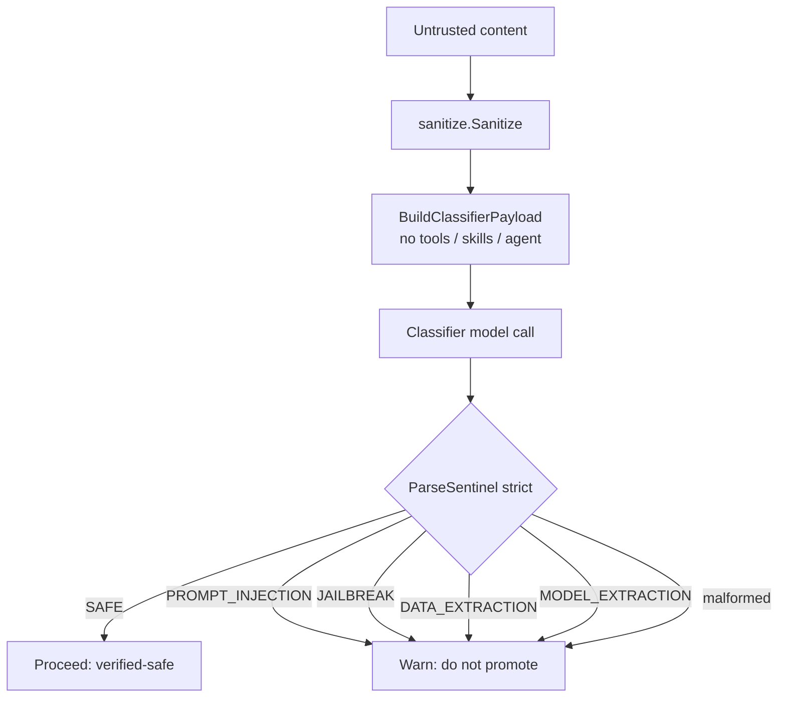
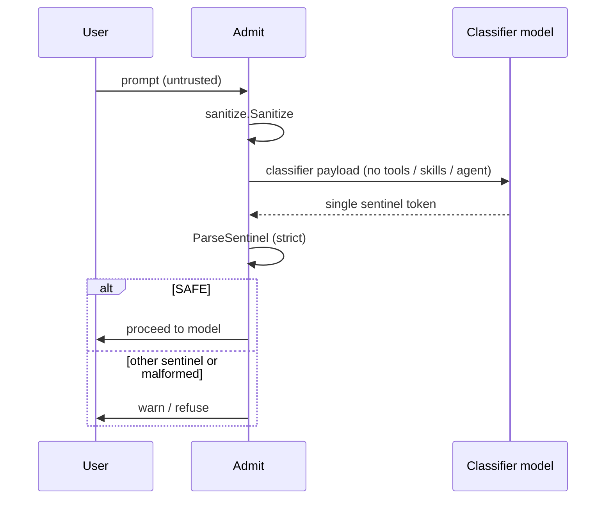
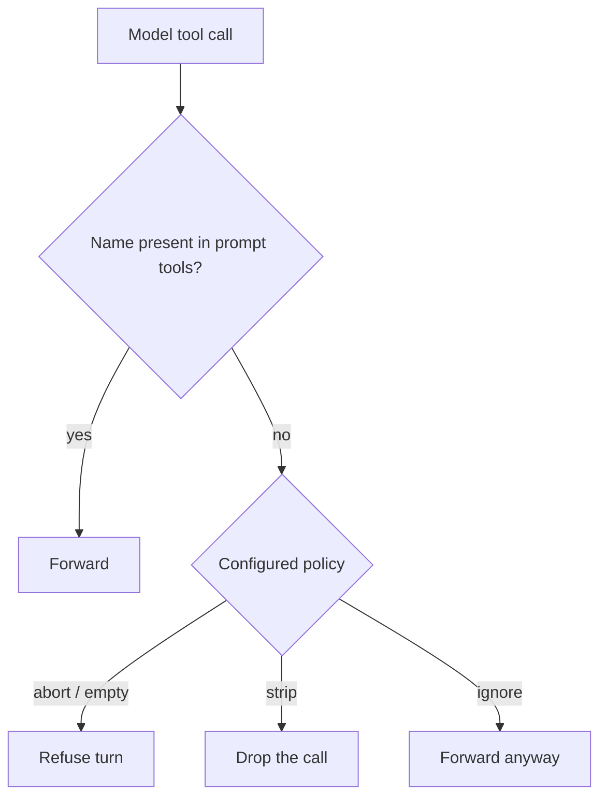
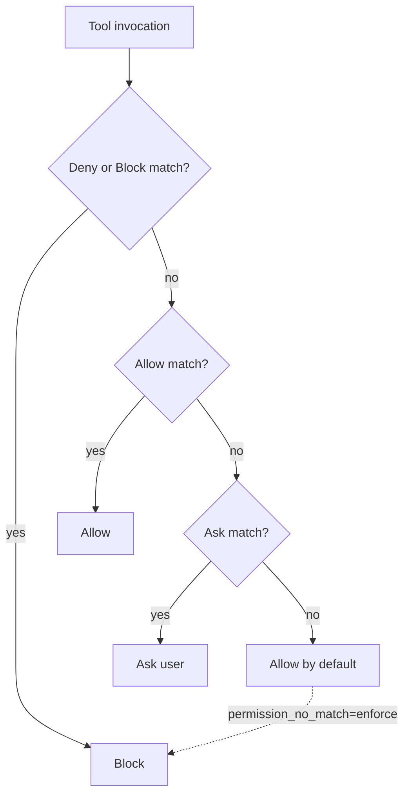
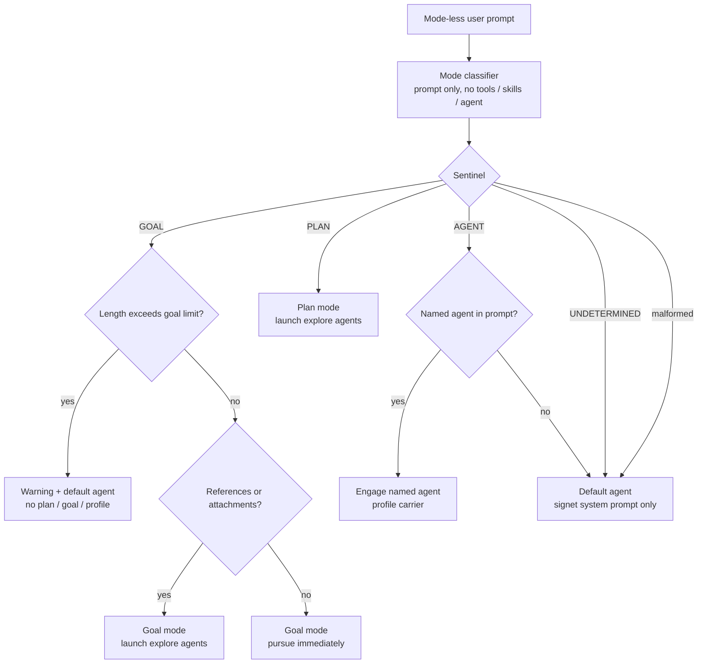
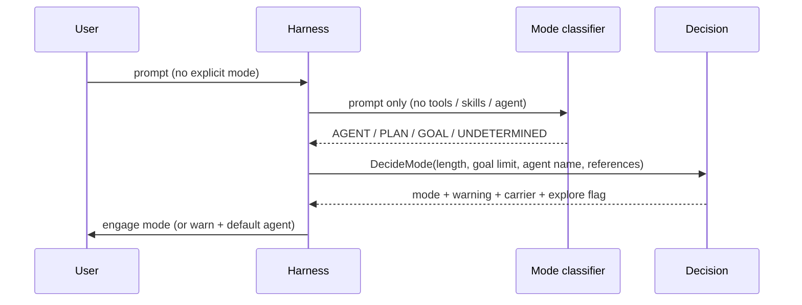
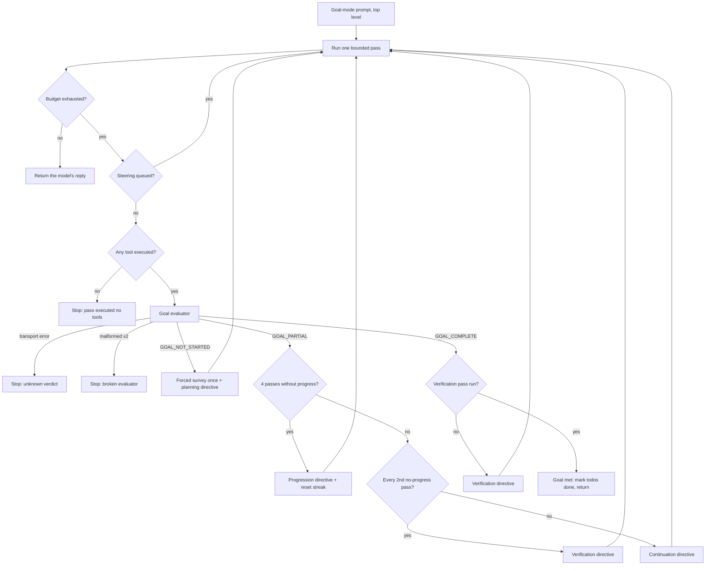
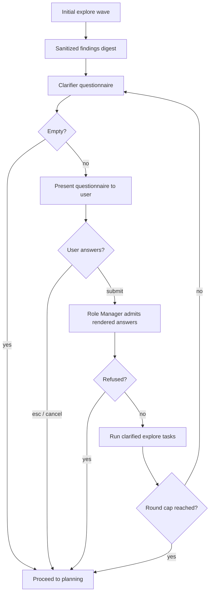

# Role Manager

The Role Manager is Signet's central safety boundary. It decides what untrusted
content may be trusted, what tool calls may execute, what may enter the
system/agent prompt, and which operating mode a mode-less prompt should engage.

This document is the normative reference for the Role Manager's business rules.
The architecture overview lives in [architecture.md](architecture.md).

## Component map

| Component | Package | Responsibility | Status |
| --------- | ------- | -------------- | ------ |
| Security classifier | `internal/rolemanager` | Classify untrusted content into a single security sentinel | Live |
| Pipeline | `internal/rolemanager` | sanitize → classify → sentinel decision for tool results | Live |
| Boundaries | `internal/rolemanager` | Guarantee untrusted text never enters system/agent blocks | Live |
| Prompt admission | `internal/rolemanager` | sanitize → classify → sentinel decision for user prompts | Live |
| Posture system | `internal/posture` | Per-gate enforce / warn / ignore policy with CLI + YAML load | Live |
| Tool-call invariants | `internal/rolemanager` | Reconcile model tool calls with the tools in the prompt | Live |
| Mode classifier | `internal/rolemanager` | Classify a mode-less prompt into agent/plan/goal | Live |
| Forced mode | `internal/rolemanager` | Build the decision for a mode the user chose explicitly, bypassing the classifier | Live |
| Goal evaluator | `internal/rolemanager` | Single-token verdict on goal progress at a pass boundary | Live |
| Goal pass loop | `internal/agent` | Grant further passes while a goal measurably advances | Live |
| Agent-loop evaluator | `internal/rolemanager` | Single-token verdict on a background loop agent at its budget boundary | Live |
| Directive framing | `internal/rolemanager` + `internal/run` | Seal harness continuation instructions into `<directive>` blocks | Live |
| Todo list | `internal/todos` | One tracked plan per session, advanced from assistant text only | Live |
| Permissions | `internal/permissions` | Allow / ask / block per tool (Claude settings shape) | Live |
| Skill validation | `internal/skills` | Reject skills with invalid front-matter before load | Live |
| Hook validation | `internal/hooks` | Reject hooks with invalid schema or unsafe code paths | Live |
| Sanitizer | `internal/sanitize` | Neutralise harness delimiter markup in untrusted content | Live |
| Delimiters | `internal/delimiters` | Nonce + SHA-256 integrity sealing and egress verification | Live |
| Nonce pool | `internal/nonce` | CSPRNG nonce lifecycle (reserve / release / rotate) | Live |
| Prompt assembly | `internal/prompt` | Build system prompt from base text + optional carrier | Live |
| Mode decision | `internal/modes` | Plan-mode read-only gate and mode constants | Live |
| Tool executor | `internal/agent` | Registry lookup → permission check → execute → pipeline | Live |
| Streaming | `internal/run` | Send turns and parse tool calls from provider responses | Live |
| Carrier resolution | `internal/agent` | Resolve active plan/goal/profile into prompt.Options | Live |
| Credential resolution | `internal/credentials` | Detect configured providers and select the right default | Live |
| Mode cycling | `internal/tui` | shift+tab cycles agent → plan → goal with persistence | Live |
| Status bar | `internal/tui` | Provider·model, mode chip, cwd, git branch, context-usage bar + percentage | Live |
| Banner | `internal/tui` | Pix owl rendered with half-blocks, ASCII fallback | Live |
| Settings UI | `internal/tui` | /settings browser (write-through) + /permissions editor | Live |
| Model picker | `internal/tui` | /model provider tabs, model list, effort, scope | Live |
| Session store | `internal/session` | Append-only JSONL; TUI owns a live session; /compact forks | Live |
| Context metering | `internal/transcript` + `internal/modelinfo` | Hybrid usage accounting with context-window registry | Live |
| Streaming tool calls | `internal/tui` | Render tool-use deltas in the TUI stream | Live |
| Working indicator | `internal/tui` | Role Manager activity pill plus generic working label in the Ask composer | Live |
| File attachments | `internal/tui` | Parse `@file` references, seal SAFE contents as `<attachment>` blocks | Live |
| Inline shell | `internal/tui` | Execute `!cmd` and round-trip output under the debug profile | Live |
| Agent builder classifier | `internal/agentprofile` | LLM-driven profile generator with schema-validation loop and max-attempts bounding | Live |
| Explore-agent launch | `internal/explore` + `internal/agent` | Auto-launch read-only explore subagents for PLAN / GOAL with references | Live |

## Trust model

Only two sources are trusted enough to enter system/agent blocks. Everything
else is untrusted until the Role Manager proves otherwise.

| Source | Trusted? | Meaning |
| ------ | -------- | ------- |
| `harness` | Yes | Fragments generated by the harness itself |
| `tool` | Yes | Output of trusted internal tools (e.g. the Vulnetix CLI) |
| anything else | No | Never enters system or agent blocks |

Note: plan text, goal text, and agent profile text are loaded from disk by the
harness on behalf of the user, so they are harness-owned and legitimately
`SourceHarness` when carried in the system prompt.

## Security classification

Untrusted content is sent to a classifier model with a specialised system
prompt and **no tools, no skills, and no agent block**. The classifier must
answer with exactly one sentinel token. The sentinel is parsed strictly:
anything that is not an exact token fails closed.

### Security sentinels

| Sentinel | Meaning | Decision | Status |
| -------- | ------- | -------- | ------ |
| `SAFE` | Content is benign | **Proceed** — content is verified-safe | Live |
| `PROMPT_INJECTION` | Direct or indirect prompt injection | **Warn** — do not promote | Live |
| `JAILBREAK` | Jailbreak or safety override | **Warn** — do not promote | Live |
| `DATA_EXTRACTION` | Training-data extraction / membership inference | **Warn** — do not promote | Live |
| `MODEL_EXTRACTION` | Model extraction / model stealing | **Warn** — do not promote | Live |
| _anything else_ | Malformed output (not one token) | **Warn** — fail closed | Live |

### Classifier payload invariants

Every classifier payload builder keeps the classifier turn tool-less, skill-less,
and agent-less. The invariant holds for all six builders:

| Payload builder | System prompt | User content | Tools / Skills / Agent |
| --------------- | ------------- | ------------ | ---------------------- |
| Security | `internal/rolemanager/classify.go` | single untrusted blob | empty |
| Mode | `internal/rolemanager/modeclassify.go` | the user prompt only | empty |
| Compaction | `internal/rolemanager/compact.go` | serialized conversation | empty |
| Session name | `internal/rolemanager/sessionname.go` | first user message | empty |
| Goal evaluator | `internal/rolemanager/goaleval.go` | goal + rendered todo list + sanitized pass-evidence digest | empty |
| Agent-loop evaluator | `internal/rolemanager/agenteval.go` | the agent profile's goals + its most recent output | empty |

| Invariant | Rule | Status |
| --------- | ---- | ------ |
| Tools | Always empty — the classifier turn exposes no tools | Live |
| Skills | Always empty | Live |
| Agent block | Always empty | Live |
| User content | Only the single untrusted blob under test | Live |
| System prompt | The specialised classifier prompt only | Live |

### Attachment admission

`@file` references typed in the TUI are resolved against the working
directory, read with the bounded `Read` tool, and run through the same
`sanitize → classify` pipeline as any other untrusted tool result. Only
`SAFE` attachments are sealed with a fresh nonce from the active pool and
appended to the user turn as an `<attachment>` block. Rejected attachments are
shown in the attachment strip and are never sent.

`HasReferences` on `rolemanager.ModeInput` is set when any `SAFE`
attachment is present, so a goal-classified prompt with attachments engages
explore mode rather than pursuing immediately.

### Compaction payload

`/compact` serializes the live conversation into one plain-text block wrapped in
`<conversation id="…">` tags and hands it to the compaction classifier. The
conversation-as-document design is what makes the turn safe: a serialized
document cannot be "continued", and tool-lessness is structural — the payload
carries no tools, no skills, and no agent block.

The summary section contract is `## Goal`, `## Constraints & Preferences`,
`## Progress` (with `### Done` / `### In Progress` / `### Blocked`),
`## Key Decisions`, `## Next Steps`, `## Critical Context`.
`rolemanager.ValidateSummary` fails closed: it rejects an empty summary and any
summary lacking `## Goal`, `## Next Steps`, or `## Critical Context`, then runs
the result through `sanitize.Sanitize`.

**The summary is untrusted.** It is produced by a model from conversation text
that may embed tool output. It re-enters the prompt as a *user* turn, never a
system block, so "untrusted content stays untrusted" holds. The nonce'd
`<conversation>` wrapper plus sanitization before store are the two mitigations
that keep tool output from closing a wrapper it does not know.

### Session-name payload

Auto-naming sends only the first user message to the naming classifier.
`rolemanager.ParseSessionName` is a strict single-line parse: trim and reject
empty, reject more than one non-empty line, strip control characters and
matched wrapping quotes/backticks, collapse whitespace, reject a leading `/`
and any non-printable rune, then truncate rune-safely to 48 runes. A malformed
reply fails closed to *unnamed* rather than taking a mangled or
attacker-chosen title.

### Security decision tree



## Prompt admission

User prompts are untrusted. Before a prompt may be sent to the model it is
sanitized and classified under the same strict rules as tool results.  The
admission step is distinct from the tool-result pipeline so that a refusal
can be surfaced early and no API call is wasted.

### Admission rules

| Step | Rule | Status |
| ---- | ---- | ------ |
| 1. Sanitize | Strip every harness delimiter tag and nonce/integrity attribute | Live |
| 2. Classify | Send only the sanitized prompt, with zero tools/skills/agent | Live |
| 3. Parse | Accept only an exact sentinel token | Live |
| 4. Decide | `SAFE` → proceed; any other sentinel or malformed → warn | Live |
| Fail-closed | A classifier transport error propagates; malformed output warns | Live |

### Admission flow



### TUI activity signal

While a prompt is in flight, the TUI Ask composer distinguishes Role Manager
activity from generic I/O:

| Activity | Signal | Status |
| -------- | ------ | ------ |
| Pre-prompt admission, mode selection, steering admission, tool-result classification | Filled `role manager` pill plus a sub-phase caption (`pre-prompt processing`, `classifying steering`, `classifying tool result`) | Live |
| Model streaming, tool execution, retry back-off | Plain `working` label (amber) | Live |

The user prompt is echoed to the transcript as a `user prompt` the instant
Enter is pressed — before admission and before any provider I/O — so the
indicator always refers to work the user cannot otherwise see. The agent
emits `EventRoleManagerKind` with the sub-phase at every classification point;
model and tool events drive the generic phase. `esc` in the pre-send window
(echoed but not yet classified) cancels the turn without sending.

## Pipeline

Read / WebSearch / WebFetch results are untrusted. They flow through the
pipeline before they may be promoted. No tool executes during the classifier
turn.

### Pipeline rules

| Step | Rule | Status |
| ---- | ---- | ------ |
| 1. Sanitize | Strip every harness delimiter tag and nonce/integrity attribute | Live |
| 2. Classify | Send only the sanitized content, with zero tools/skills/agent | Live |
| 3. Parse | Accept only an exact sentinel token | Live |
| 4. Decide | `SAFE` → proceed; any other sentinel or malformed → warn | Live |
| Fail-closed | A classifier transport error propagates; malformed output warns | Live |

### Pipeline flow

```mermaid
sequenceDiagram
    participant H as Harness
    participant S as Sanitizer
    participant Ca as Cache
    participant C as Classifier model
    participant B as Boundary

    H->>S: tool result (untrusted)
    S-->>H: sanitized content
    H->>Ca: lookup by content hash
    alt cache hit
        Ca-->>H: cached sentinel
    else cache miss
        H->>C: classifier payload (no tools / skills / agent)
        C-->>H: single sentinel token
        H->>H: ParseSentinel (strict)
        H->>Ca: store verdict
    end
    alt SAFE
        H->>B: promote as verified-safe
    else other sentinel or malformed
        H->>H: warn; do not promote
    end
```

### Chunked classification

Oversized content (above `classifier.chunk.max_bytes`) is classified in
overlapping chunks rather than rejected. The pipeline splits the sanitized
content into chunks aligned to rune boundaries; adjacent chunks overlap by one
eighth of the chunk size so an injection straddling a chunk boundary is still
seen whole by at least one chunk. The chunks classify concurrently, capped by
`classifier.chunk.concurrency`.

The per-chunk verdicts fold fail-closed:

| Condition | Result |
| --------- | ------ |
| Any chunk returns a non-`SAFE` sentinel | The whole content is that sentinel |
| Any chunk returns malformed output | The whole content is malformed |
| Every chunk returns `SAFE` | The whole content is `SAFE` |

### Verdict cache

The pipeline optionally memoises classifier verdicts keyed by the SHA-256 of
the sanitized content.

| Verdict type | Storage | Lifetime |
| ------------ | ------- | -------- |
| `SAFE` | In-memory session LRU | Session only; bounded by `defaultSafeCacheSize` |
| Non-`SAFE` | Persistent bad-hash set (caller-supplied path) | Until the file is removed or overwritten |

The cache is fail-open: a missing or corrupt bad-hash file simply costs a
reclassification. Non-`SAFE` hashes persist so a previously refused payload is
refused again without a classifier round trip. The caller wires the cache
into the pipeline; when no cache is provided the pipeline classifies every
payload fresh.

## Withheld-result rule

When a tool result is classified as non-`SAFE` (or malformed) and the
`tool_result_unsafe` posture is `warn`, the result is **withheld**: a
harness-generated placeholder is appended as the tool answer.  The
placeholder names the sentinel so the model knows why the result is
missing, and the `tool_call_id` is still answered so the provider does not
reject the follow-up turn.

Permission-denied and execution errors likewise receive harness placeholder
turns.

## Posture system

Every safety gate has three postures:

| Posture | Behaviour |
| ------- | --------- |
| `enforce` (default) | Fail closed — abort, refuse, or block |
| `warn` | Fail open — proceed, but emit a warning |
| `ignore` | Never evaluate the gate at all |

### Gates and defaults

| Gate | Default | Flag |
| ---- | ------- | ---- |
| `tool_result_unsafe` | `enforce` | `--allow-unsafe-tool-result` |
| `tool_result_malformed` | `enforce` | `--allow-malformed-tool-result` |
| `prompt_unsafe` | `enforce` | `--allow-unsafe-prompt` |
| `prompt_malformed` | `enforce` | `--allow-malformed-prompt` |
| `tool_call_mismatch` | `enforce` (`abort`) | `--tool-call-mismatch=abort\|strip\|ignore` |
| `permission_no_match` | `ignore` (allow) | `--allow-unpermitted-tools` |
| `permission_ask_no_tty` | `enforce` | `--allow-ask-without-tty` |
| `skill_invalid` | `enforce` | `--allow-invalid-skills` |
| `hook_invalid` | `enforce` | `--allow-invalid-hooks` |

Precedence: CLI flag > project `preferences.yaml` > global `preferences.yaml` >
safe default. `--dangerously-yolo-everything` maps every gate above to `ignore`
and prints a prominent startup banner.

The boundary source gate (`VerifyTrustedBlocks`) and egress nonce/integrity
stripping (`delimiters.Egress`) are **not overridable** — they are the
invariant the whole trust model rests on.

## Boundaries

The boundary is what guarantees untrusted text can never be promoted into
system or agent blocks, regardless of what the content looks like.

### Boundary rules

| Rule | Behavior | Status |
| ---- | -------- | ------ |
| Source gate | Only `SourceHarness` and `SourceTool` are accepted | Live |
| Rejection | Any other source → error, block refused | Live |
| Assembly | `BuildSystemPrompt` renders only verified trusted blocks | Live |
| Defence | Injected text that *looks* like a harness block is still rejected on source | Live |

`BuildSystemPrompt` takes a `Noncer`, requires it non-nil, seals each block
with a reserved nonce and integrity hash, and runs `delimiters.Egress` over
the assembled prompt.

## Tool-call invariants

Every model response is checked against the tools actually present in the
prompt. A tool call for a tool that was never offered is a mismatch.

### Mismatch policies

| Policy | Behaviour | Status |
| ------ | --------- | ------ |
| `abort` (default) | Refuse the whole turn with an error | Live |
| `strip` | Drop the mismatched tool call, keep the rest | Live |
| `ignore` | Forward the mismatched tool call anyway | Live |
| empty policy | Treated as `abort` (fail closed) | Live |

### Tool-call decision tree



## Permissions

A separate layer provides allow / ask / block per tool, adopting the Claude
permission-settings shape (`allow` / `ask` / `deny`, with `block` accepted as an
alias for `deny`).

### Permission rules

| Rule | Behaviour | Status |
| ---- | --------- | ------ |
| Rule shape | `Tool` or `Tool(spec)` where `spec` is a glob (`*`, `?`) | Live |
| Precedence | `deny` / `block` beats `allow` and `ask` | Live |
| No match | Allowed by default — `permission_no_match: enforce` (preferences.yaml) restores the legacy block; unknown *tool names* are still rejected earlier by the registry check | Live |
| Alias | `block` is accepted and treated as `deny` | Live |
| `FromSimple` default | Every unrecognized decision value is treated as deny | Live |

### Permission decision tree



## Skill validation

Skills load only after strict front-matter schema validation. A malformed skill
is rejected before it is ever loaded.

### Skill front-matter schema

| Field | Required | Type / shape |
| ----- | -------- | ------------ |
| `name` | Yes | non-empty string |
| `description` | Yes | non-empty string |
| `license` | No | string |
| `compatibility` | No | string |
| `metadata` | No | string |
| `allowed-tools` | No | inline list `[a, b]` |
| `disable-model-invocation` | No | `true` / `false` |
| _unknown field_ | — | rejected |

### Skill validation rules

| Rule | Behaviour | Status |
| ---- | --------- | ------ |
| Missing delimiter | Rejected | Live |
| Unterminated front-matter | Rejected | Live |
| Missing/empty `name` | Rejected | Live |
| Missing/empty `description` | Rejected | Live |
| Unknown field | Rejected | Live |
| Malformed `allowed-tools` | Rejected | Live |
| Malformed `disable-model-invocation` | Rejected | Live |
| Malformed front-matter line | Rejected | Live |
| `#` comment lines | Silently skipped | Live |

## Hook validation

Hooks load only after schema validation, and command paths are checked so a
hook cannot inject an arbitrary code path.

### Hook schema

| Field | Required | Shape |
| ----- | -------- | ----- |
| `name` | Yes | non-empty string |
| `event` | Yes | one of the known events below |
| `command` | Yes | safe relative path |

Known events: `pre_tool`, `post_tool`, `session_start`, `session_end`,
`pre_edit`, `post_edit`.

### Hook command-path rules

| Rule | Behaviour | Status |
| ---- | --------- | ------ |
| Empty command | Rejected | Live |
| Absolute path | Rejected — must be relative | Live |
| `..` traversal | Rejected — may not escape the hooks directory (purely lexical check) | Live |
| Shell metacharacters (`; & \| \` $ < > " '`) | Rejected | Live |
| Malformed JSON | Rejected | Live |

The check is purely lexical; `validateCommandPath` takes no hooks-root argument.

## Operating-mode classification

When a user prompt does not explicitly name a mode, the Role Manager runs in
prompt-classifier mode: it sends **only the prompt** (no attachment contents, no
referenced files) to the model with a prompt-classifier system prompt and no
tools, skills, or agent block, and derives the most likely mode from a single
sentinel.

Mode detection is automatic for all mode-less prompts; `--detect-mode` is a
reporting toggle that prints the decision to stderr.

### Mode sentinels

| Sentinel | Meaning | Status |
| -------- | ------- | ------ |
| `AGENT` | General interactive coding request | Live |
| `PLAN` | Read-only investigation, plan before changes | Live |
| `GOAL` | A specific objective to track and complete | Live |
| `UNDETERMINED` | Cannot confidently classify | Live |
| _malformed output_ | Treated as `UNDETERMINED` (fail closed) | Live |

### Mode decision rules

| Condition | Engaged mode | Carrier | Explore |
| --------- | ------------ | ------- | ------- |
| `AGENT`, no named agent | Default agent | none (signet system prompt only) | no |
| `AGENT`, `@agent:NAME` present | Agent | profile (the named agent) | no |
| `PLAN` | Plan | plan | yes (launch explore agents) |
| `GOAL`, length ≤ limit, no references | Goal | goal | no (pursue immediately) |
| `GOAL`, length ≤ limit, references present | Goal | goal | yes (explore first) |
| `GOAL`, length > limit | Default agent + warning | none | no |
| `UNDETERMINED` / malformed | Default agent | none | no |

- The goal length limit defaults to `DefaultGoalPromptLengthLimit` (4000 runes).
- A named agent is referenced as `@agent:NAME`.
- `HasReferences` and `GoalLimit` are set at every call site.

### Forced mode

A mode the user selected — `shift+tab` in the TUI, or `/mode <name>` — is not a
guess, so it is not re-guessed. `TurnInput.ForceMode` carries the choice into
`Session.run`, which rebuilds the decision with
`rolemanager.DecideForcedMode(mode, prompt, hasReferences)` **after** the
classifier has already run, discarding the classifier's answer.

Suppressing the TUI's own classification is not sufficient on its own:
`Session.run` classifies again internally, so without `ForceMode` the explicit
choice is silently discarded on the way to the session.

| Forced mode | Decision | Explore |
| ----------- | -------- | ------- |
| `goal` | Goal carrier, length limit **not** applied | only when references are present |
| `plan` | Same as a `PLAN` sentinel | yes |
| `agent` | Same as an `AGENT` sentinel, named agent preserved | no |
| anything else | Falls back to the `UNDETERMINED` path (default agent) | no |

The goal length limit is deliberately skipped for a forced goal. That limit
exists to stop the *classifier* from routing a long prompt into goal mode by
mistake; a user who selected goal mode has made no mistake to guard against.

`ForceMode` is one-shot: it applies to the turn that carried it and is cleared
as soon as the turn is sent, matching how `modeExplicit` behaves in the TUI.

`ForceAgent` (`@agent:NAME`) is applied *after* `ForceMode`, because it is the
narrower statement of intent — it names a profile as well as a mode.

### Operating-mode decision tree



### Operating-mode flow



## Carrier resolution

After mode detection, the harness resolves the active carrier:

| Mode | Source | Fallback |
| ---- | ------ | -------- |
| Plan | `plans.Load(workdir, state.ActivePlan)` | Empty options (no hard error) |
| Goal | `goals.Load(workdir, state.ActiveGoal)` | Empty options (no hard error) |
| Agent (named) | `profiles.Load(decision.AgentName)` | Warn + default agent |

`config.LoadMerged(workdir).Caveman` is also threaded into `prompt.Options`.
`CarrierOptions(workdir, decision, state, settings)` returns a bare
`prompt.Options{}` on any load failure so that a missing plan file never
becomes a hard "build system prompt" error on the live path.

## Max-iteration bound

The agent loop is bounded to prevent infinite tool-call loops. The default
maximum is 10 iterations; each provider turn counts as one iteration. One run
of that bounded loop is a **pass**.

Outside goal mode — and for every subagent, whatever its mode — exactly one
pass runs, and exhausting the iteration budget returns
`max iterations (N) reached`. A top-level goal-mode prompt instead enters the
goal pass loop below, where exhausting the budget is a question ("is the goal
met?") rather than an answer.

## Goal pass loop

A goal is not finished when the tool budget runs out; it is finished when the
goal is met. The pass loop makes that the terminating condition: when a pass
burns its whole iteration budget, an evaluator decides whether the work
advanced, and only a loop that is *not* advancing stops.

The loop is **unbounded by design**. Every mechanism below is a stall
detector, not a ceiling: none of them can stop a loop that is making
measurable progress.

### Entry conditions

All three must hold, or a single bounded pass runs instead:

| Condition | Why |
| --------- | --- |
| `Options.AllowPassLoop` is true | Only top-level session construction sets it. A subagent must never enter the loop, which would spawn recursive unbounded subagents. It is a distinct authority from `AllowExplore`. |
| The engaged mode is `goal` | Agent and plan mode keep today's bounded behaviour verbatim. |
| The pass exhausted its iteration budget | A pass that ends with a plain reply returns it. A goal is only re-checked when the model burns the whole budget. |

### Pass ledger

The loop's decision state lives in a loop-local `passLedger` — never in
`turns`, and never re-parsed out of transcript text. This is a trust boundary:
if pass count, verification count, or sentinel history were derived from
content, a `SAFE`-classified file containing the right token could flip harness
state.

| Field | Meaning |
| ----- | ------- |
| `passes` | Passes run so far; reported as `Result.Passes`. |
| `list` / `hasList` | The shared todo list (`internal/todos`). |
| `todoChanged` | The pass that just ended moved at least one item's state. |
| `partialStreak` | Consecutive no-progress `GOAL_PARTIAL` verdicts. A todo transition resets it to 0. Reaching `goalStallPartial` (`2 × goalVerifyEvery`) injects a progression directive and resets the streak to start a new agentic evaluation loop. |
| `verificationPasses` | Finished verification passes; gates `GOAL_COMPLETE`. |
| `malformedStreak` | Consecutive malformed evaluator replies. A clean reply resets it. |
| `surveyedLastPass` | The pass that just ended ran on forced-survey findings. |
| `overflowRetried` | A context overflow has already been recovered once this prompt. |

### Goal evaluator

At each pass boundary the evaluator is shown the goal, the rendered todo list,
and a **sanitized** digest of that pass's turns (`transcript.Serialize`, with
tool results bounded by `transcript.DefaultMaxToolResultChars`). Its reply must
be exactly one token.

| Sentinel | Meaning | Loop response |
| -------- | ------- | ------------- |
| `GOAL_COMPLETE` | Every todo item is done and the goal is achieved | Accepted only past the verification gate; otherwise downgraded to a verification pass |
| `GOAL_PARTIAL` | Work advanced but the goal is not met | Grant another pass with a continuation directive |
| `GOAL_NOT_STARTED` | No meaningful work has happened yet | Force a codebase survey (once), then inject the planning directive |
| _malformed output_ | — | Fails closed to `GOAL_PARTIAL`; the streak is counted |

### Termination rules

| Rule | Condition | Outcome |
| ---- | --------- | ------- |
| Goal met | `GOAL_COMPLETE` **and** `verificationPasses ≥ 1` | Success; todo list marked complete; reply is the pass's last assistant text |
| Natural exit | A pass ends with no tool calls | Success; the model's reply is returned unchanged |
| Verification gate | `GOAL_COMPLETE` with `verificationPasses == 0` | Downgraded: arm one verification pass and continue. Harness logic — the model cannot talk its way past it |
| Progression reset | `partialStreak ≥ 4` (`2 × goalVerifyEvery`) in `GOAL_PARTIAL` or at the verification gate | A progression directive with session context is injected and `partialStreak` is reset, starting a new agentic evaluation loop; the loop does not abort for stall |
| Unproductive pass | A pass executed no non-withheld tool result | Error: *pass N executed no tools*. Truncation repair burns iterations without doing work and must not buy another pass |
| Broken evaluator | 2 consecutive malformed evaluator replies | Error: *N consecutive malformed evaluator replies* |
| Evaluator transport failure | `Classify` returns an error | Terminal. An unknown verdict must not grant compute |
| Cancellation | `ctx` cancelled (`esc`, `SIGINT`) | `ErrPassLoopCancelled` with the partial result — never a raw `context.Canceled` |
| Configured ceiling | `resilience.max_passes` reached (0 = unbounded, the default) | Error: *max passes (N) reached* |

### Verification passes

Every second consecutive no-progress `GOAL_PARTIAL`
(`partialStreak % goalVerifyEvery == 0`, `goalVerifyEvery = 2`) becomes a
verification pass: the injected directive orders the model to check the
completed todo items against the files on disk, read-only, before doing further
work. `GOAL_COMPLETE` is accepted only after at least one verification pass has
finished, so "done" is always claimed at least once *after* an explicit
re-check.

### Directives

A continuation instruction is harness-authored text that re-enters the
conversation as a user turn, so the model must be able to tell it apart from
something it wrote or read. Three mechanisms do that together:

1. **Framing** — `DirectivePrefix` / `DirectiveSuffix` prose wraps it, followed
   by a synthetic assistant `DirectiveAck`, so the model reads it as context
   rather than as the question to answer. This mirrors the compaction
   `SummaryPrefix` / `SummaryAck` framing.
2. **Sealing** — the body travels in `run.Turn.Directive`, a field separate from
   `Content`, and is wrapped in a `<directive nonce="…" integrity="…">` block at
   egress. It is a separate field because `egressTurns` sanitizes `Content`
   first — which strips every known harness kind — so a directive written into
   `Content` would be silently deleted on its way to the provider.
3. **Fail-closed drop** — a directive that cannot be sealed (no nonce available)
   is dropped rather than sent as bare prose the model could mistake for a user
   instruction.

| Directive | Injected when |
| --------- | ------------- |
| Planning | `GOAL_NOT_STARTED` — write a numbered plan under a `Plan:` header, then start step 1 |
| Verification | An armed verification pass — re-check completed items against disk before continuing |
| Continuation | `GOAL_PARTIAL` — continue from the rendered todo list state |
| Progression | `partialStreak` reaches `goalStallPartial` — review session context, rendered todo list, and identify the single most concrete next step forward; reset the streak and start a new agentic evaluation loop |

### Forced survey

A `GOAL_NOT_STARTED` verdict forces a read-only codebase survey
(`explore.PlanGoalSurvey`) before the planning directive — repository
structure, entry points, and tests/docs bearing on the goal. It does **not**
re-ask the original prompt: a goal-mode prompt usually carries no
`@references`, so the ordinary explore plan would just repeat the question back.
The survey runs at most once per `GOAL_NOT_STARTED` streak
(`surveyedLastPass`), and its findings re-enter as untrusted user turns like
any other explore result.

### Todo markers

The shared todo list is advanced **only** from the pass's accumulated
model-authored assistant text. Tool results, file contents, and every other
untrusted string are excluded by construction — `passOutcome.text` accumulates
assistant text alone. A repository file containing `[DONE:1] [DONE:2]` must
never mark work complete, because completion is an input to whether the loop
stops. `plans.ParseDoneMarkers` is the single definition of the marker syntax;
`todos.List.ApplyMarkers` and `modes.PlanState.ApplyMarkers` both call it.

### Steering precedence

A steering message queued while a pass is running outranks the evaluator: if
`drainSteer` returns anything at a pass boundary, the loop appends it and
continues without calling the evaluator. Explicit user intent beats a
classifier, and skipping the call saves a model round-trip. Steered turns pass
through the same Role Manager admission as the original prompt.

### Compaction at the boundary

A `ClassOverflow` error escaping a pass is recovered **once** per prompt:
compact at the pass boundary, then re-run the pass. A second overflow is
terminal.

Compaction only ever runs at a pass boundary. Mid-pass, `turns` may hold an
assistant turn with `tool_calls` whose matching tool turns are not yet
appended; truncating there would orphan `tool_call_id`s and providers reject
the payload. It triggers when the estimated context exceeds
`compactThresholdPct` (70 %) of the resolved model window.

The summary is model output derived from tool results, so it is admitted
through the Role Manager before re-injection — the same fail-closed rule as
steering, and deliberately stricter than the TUI `/compact` path, which does
not admit. Any failure skips compaction for that boundary; the next boundary
retries.

### Sealed-once invariant

`sanitize` through `SealSystem` runs once per prompt, in `Session.run`. The
system prompt is passed into the loop as a value and every pass reuses the same
sealed bytes. Re-sealing would rotate nonces and invalidate already-sealed
tool-result blocks (see [resilience.md](resilience.md), "Turn retry and state
invariants").

### Goal pass loop decision tree



## Agent-loop evaluator

Background agents in `loop` mode use the same shape for a different question:
not "is the goal met?" but "should this agent keep spending tokens?". At the
end of each inner budget (`max_iterations`), the evaluator is shown the
profile's goals and the agent's most recent output.

| Verdict | Meaning | Manager response |
| ------- | ------- | ---------------- |
| `CONTINUE` | Goals unmet, keep working now | Reset the inner budget and continue — **autonomous profiles only** |
| `PAUSE` | Stop and wait for the user | Enter `paused`; the goroutine blocks until `/agent resume` |
| `SLEEP` | Wait one schedule interval, then continue | Sleep `profile.schedule`, reset the inner budget |
| `STOP` | The work is finished | Exit the loop; state becomes `done` |
| _malformed output_ | — | Fails closed to `PAUSE` |
| _transport error_ | — | Surfaced as an error event, then `PAUSE` |

A **supervised** profile that receives `CONTINUE` is paused instead. Unattended
unbounded tool use is exactly what `supervised` exists to prevent, so
autonomous operation stays an explicit opt-in that a classifier cannot grant.

## Clarify loop

After the initial read-only explore wave finishes, ambiguous plan-mode prompts
enter an interactive clarification round before planning. The loop is gated by
`resilience.max_clarify_rounds` (default 3; 0 means default; negative disables
it). The loop only runs when both the engaged mode requests exploration and
the session was built with `AllowClarify` — only the interactive TUI sets that
flag; subagents and the non-interactive CLI leave it false so they never block
on a user reply.

### Schema

A questionnaire contains 1–6 groups. Each group has one context sentence and
2–4 options. `multi` is optional and defaults to false.

```json
{
  "groups": [
    {
      "context": "The repo has two nonce pools...",
      "multi": false,
      "options": [
        {"label": "Parent pool", "description": "Reuse the session pool"},
        {"label": "Fresh child pool", "description": "Seed a local pool per round"}
      ]
    }
  ]
}
```

### Validation rules (all fail closed)

| Rule | Limit |
| ---- | ----- |
| `groups` | 1–6, non-empty |
| `context` | non-empty, single line, ≤200 runes, ends `.` or `?` |
| duplicate `context` | rejected |
| `options` | 2–4 per group |
| `label` | non-empty, single line, ≤80 runes, unique within the group |
| `description` | optional, single line, ≤160 runes |
| `multi` | optional bool, defaults false |
| unknown JSON field | rejected by the decoder |
| every string | run through `sanitize.Sanitize` after parse |

`{"groups": []}` is the legal end-of-questions signal.

### Loop behaviour



1. The clarifier classifier sees only the original prompt and a sanitized
   digest of the explore findings.
2. The user's answers are rendered into a harness-authored user turn, then
   sanitized and admitted through the same `sanitize → classify` pipeline as
   steering messages.
3. Each answered (non-skipped) group becomes one read-only explore task via
   `explore.PlanClarified`, capped at `MaxTasks`.
4. A refused answer set, an empty questionnaire, a cancellation, or hitting the
   round cap ends the loop and planning proceeds with whatever explore findings
   are already in context.

### TUI interaction

The questionnaire appears as a full-screen view (`internal/tui/viewClarify`):

| Key | Effect |
| --- | ------ |
| `↑` / `↓` | Move between option rows, skipping headers |
| `space` | Toggle selection (radio for single, checkbox for multi) |
| `n` | Add a note to the cursor option |
| `s` | Mark the cursor's question skipped |
| `enter` | Submit answers and resume the agent pump |
| `esc` | Cancel the turn, pop back to chat, and clear the agent event stream |

The questionnaire is also echoed into the transcript as a system notice so the
exchange survives in the session record.

## Adjacent security primitives

These sit just outside the Role Manager but feed its pipeline.

### Sanitizer rules

| Rule | Behaviour | Status |
| ---- | --------- | ------ |
| Harness delimiter tags | Removed from untrusted content (opening and closing) | Live |
| `nonce` / `integrity` attributes | Stripped from any remaining tag | Live |
| Normal text | Passed through unchanged | Live |
| Other attributes | Preserved | Live |

`Sanitize` removes only the *tags* of known kinds and keeps the enclosed
content.

### Delimiter / nonce / integrity rules

| Rule | Behaviour | Status |
| ---- | --------- | ------ |
| Block shape | `<kind nonce="…" integrity="…">content</kind>` | Live |
| Known kinds | `system`, `agent`, `plan`, `goal`, `tools`, `skills`, `hooks`, `attachment`, `exploration`, `directive` | Live |
| Integrity | `integrity` is lowercase hex SHA-256 of the enclosed content | Live |
| Nonce | 128-bit CSPRNG; only *reserved* nonces are valid | Live |
| Egress — missing nonce | Block stripped | Live |
| Egress — unknown nonce | Block stripped | Live |
| Egress — integrity mismatch | Block stripped **only when an `integrity` attribute is present and non-empty** | Live |
| Egress — valid | Block preserved | Live |
| Egress — `<attachment>` without integrity | Stripped (attachment blocks must carry an integrity attribute) | Live |
| Egress — `<directive>` without integrity | Stripped. A directive carries harness authority, so a nonce alone would let a replayed block have its body swapped | Live |
| Egress — nil checker | A nil `NonceChecker` skips nonce validation entirely | Live |
| Provider nonces | `GET {base_url}/v1/nonces`; fallback only on `ErrUnsupported` (HTTP 401/403/404) | Live |
| NonceURL | Strips a trailing `/v1` before appending `/v1/nonces` | Live |

## Agent builder classifier

The agent builder (`/agent create`) reuses the `rolemanager.Classifier`
interface so it works with any configured provider. The builder sends a
dedicated system prompt (the "agent designer") plus the user's natural-language
request, expecting the model to reply with valid JSON matching the
`AgentProfile` schema.

### Builder system prompt invariants

The agent-designer system prompt instructs the model to:
1. Emit structured reasoning (`<thinking>` or a JSON `reflection` field) before
the final profile, encouraging explicit tool-allowlist justification and
self-correction.
2. Emit **only** valid JSON matching the `AgentProfile` schema.
3. Include no Markdown fences, no prose outside the JSON, and no trailing text.

### Schema-validation loop

| Step | Rule |
| ---- | ---- |
| 1. Build payload | Agent-designer system prompt + user request → classifier (no tools / skills / agent) |
| 2. Parse reply | Attempt strict JSON parse into `AgentProfile` |
| 3. Validate | Run `AgentProfile.Validate()` — checks required fields, known modes, valid tool names, autonomy enum |
| 4. Retry on failure | Append validation errors as a user turn and re-send; fail closed after `MaxAttempts` |
| 5. Sanitize feedback | Validation error text is sanitized (`sanitize.Sanitize`) before being appended to the conversation |

### Max-attempts bounding

`Builder.MaxAttempts` defaults to 3. If the model has not produced a valid
profile after `MaxAttempts` attempts, the builder returns an error and the
profile is **not** saved to disk. The classifier turn remains tool-less,
skill-less, and agent-less for every attempt.

## Fail-closed summary

| Event | Outcome | Posture gate |
| ----- | ------- | ------------ |
| Classifier returns a non-`SAFE` sentinel | Warn, do not promote | `tool_result_unsafe` / `prompt_unsafe` |
| Classifier returns malformed output | Warn, do not promote | `tool_result_malformed` / `prompt_malformed` |
| Classifier transport error | Propagate error | — |
| Tool-call mismatch, no/empty policy | Abort | `tool_call_mismatch` |
| Tool matches no permission rule | Allow (default); block under `enforce` | `permission_no_match` |
| Skill front-matter invalid | Reject skill | `skill_invalid` |
| Hook schema / path invalid | Reject hook | `hook_invalid` |
| Clarifier output invalid or retry budget exhausted | Treat as no questions; planning proceeds without clarification | — |
| Clarification answers refused by admission | Drop answers and stop asking; proceed with current explore findings | — |
| Untrusted block reaches system/agent boundary | Reject | — |
| Delimiter lacking/unknown nonce or bad integrity | Strip before transport | — |
| Mode classifier returns malformed output | Default agent | — |
| Goal-classified prompt exceeds length limit | Default agent + warning | — |
| Goal evaluator returns malformed output | `GOAL_PARTIAL` (never completion); 2 in a row stops the loop | — |
| Goal evaluator transport error | Stop the loop — an unknown verdict grants no compute | — |
| `GOAL_COMPLETE` before any verification pass | Downgraded; one verification pass is forced (or progression directive if the loop has stalled) | — |
| No todo progress for `goalStallPartial` passes | Progression directive with session context is injected; streak is reset; new agentic evaluation loop starts | — |
| Goal pass executes no tools | Stop the loop — no evidence, no further pass | — |
| Agent-loop evaluator malformed or unreachable | `PAUSE` — stop spending, wait for the user | — |
| Supervised agent receives `CONTINUE` | `PAUSE` — autonomy is an explicit opt-in | — |
| Directive cannot be sealed | Dropped, never sent as bare prose | — |
| `[DONE:n]` marker in a tool result or file | Ignored — only assistant text advances a todo list | — |
| Compaction summary empty or missing required headings | Refuse compaction, keep session | — |
| Session-name classifier returns malformed output | Leave session unnamed | — |
