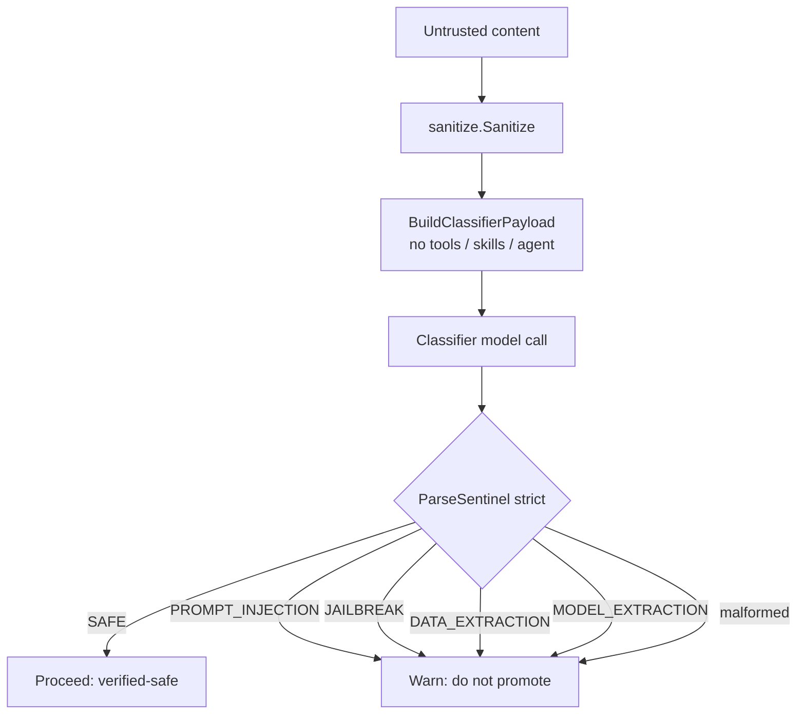
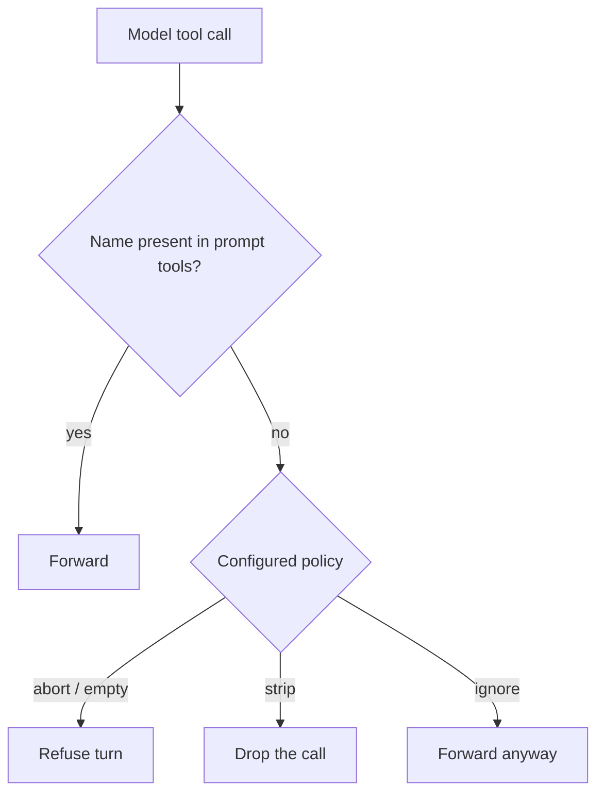
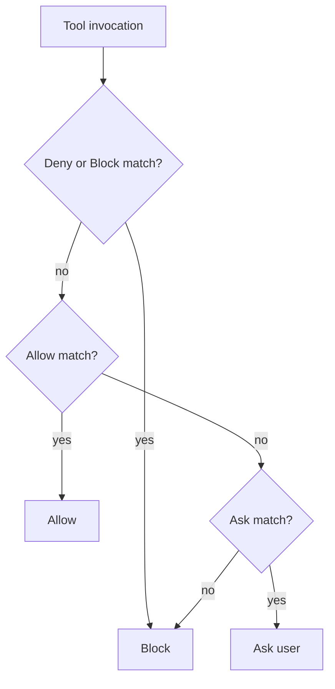
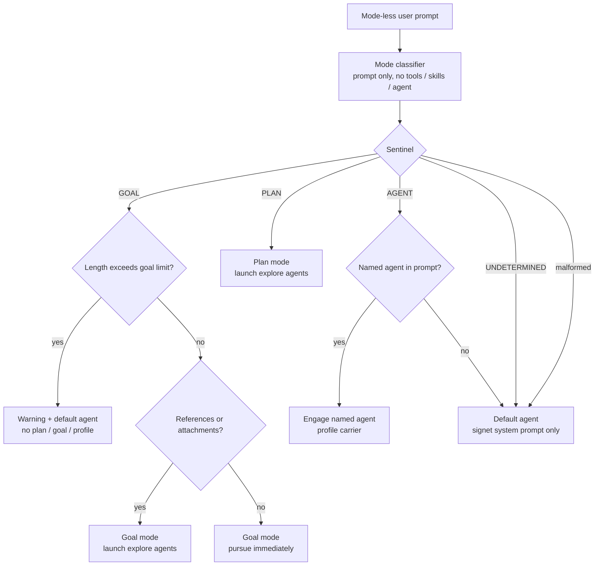
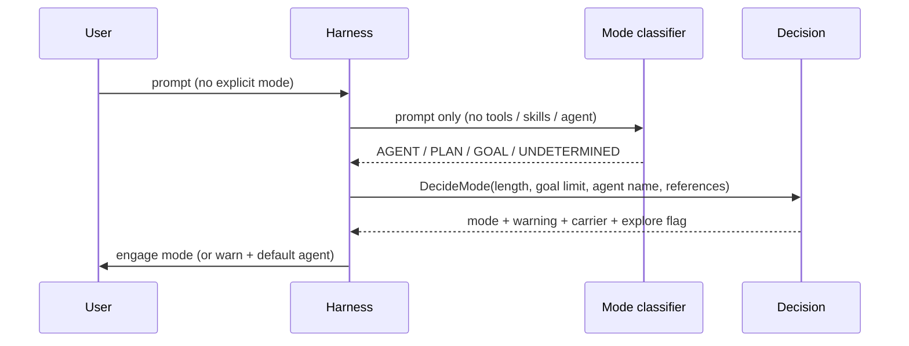

# Role Manager

The Role Manager is Signet's central safety boundary. It decides what untrusted
content may be trusted, what tool calls may execute, what may enter the
system/agent prompt, and which operating mode a mode-less prompt should engage.

This document is the normative reference for the Role Manager's business rules.
The architecture overview lives in [architecture.md](architecture.md).

## Component map

| Component | Package | Responsibility |
| --------- | ------- | -------------- |
| Security classifier | `internal/rolemanager` | Classify untrusted content into a single security sentinel |
| Pipeline | `internal/rolemanager` | sanitize → classify → sentinel decision for tool results |
| Boundaries | `internal/rolemanager` | Guarantee untrusted text never enters system/agent blocks |
| Tool-call invariants | `internal/rolemanager` | Reconcile model tool calls with the tools in the prompt |
| Mode classifier | `internal/rolemanager` | Classify a mode-less prompt into agent/plan/goal |
| Permissions | `internal/permissions` | Allow / ask / block per tool (Claude settings shape) |
| Skill validation | `internal/skills` | Reject skills with invalid front-matter before load |
| Hook validation | `internal/hooks` | Reject hooks with invalid schema or unsafe code paths |
| Sanitizer | `internal/sanitize` | Neutralise harness delimiter markup in untrusted content |
| Delimiters | `internal/delimiters` | Nonce + SHA-256 integrity sealing and egress verification |
| Nonce pool | `internal/nonce` | CSPRNG nonce lifecycle (reserve / release / rotate) |

## Trust model

Only two sources are trusted enough to enter system/agent blocks. Everything
else is untrusted until the Role Manager proves otherwise.

| Source | Trusted? | Meaning |
| ------ | -------- | ------- |
| `harness` | Yes | Fragments generated by the harness itself |
| `tool` | Yes | Output of trusted internal tools (e.g. the Vulnetix CLI) |
| anything else | No | Never enters system/agent blocks |

## Security classification

Untrusted content is sent to a classifier model with a specialised system
prompt and **no tools, no skills, and no agent block**. The classifier must
answer with exactly one sentinel token. The sentinel is parsed strictly:
anything that is not an exact token fails closed.

### Security sentinels

| Sentinel | Meaning | Decision |
| -------- | ------- | -------- |
| `SAFE` | Content is benign | **Proceed** — content is verified-safe |
| `PROMPT_INJECTION` | Direct or indirect prompt injection | **Warn** — do not promote |
| `JAILBREAK` | Jailbreak or safety override | **Warn** — do not promote |
| `DATA_EXTRACTION` | Training-data extraction / membership inference | **Warn** — do not promote |
| `MODEL_EXTRACTION` | Model extraction / model stealing | **Warn** — do not promote |
| _anything else_ | Malformed output (not one token) | **Warn** — fail closed |

### Classifier payload invariants

| Invariant | Rule |
| --------- | ---- |
| Tools | Always empty — the classifier turn exposes no tools |
| Skills | Always empty |
| Agent block | Always empty |
| User content | Only the single untrusted blob under test |
| System prompt | The specialised classifier prompt only |

### Security decision tree



## Pipeline

Read / WebSearch / WebFetch results are untrusted. They flow through the
pipeline before they may be promoted. No tool executes during the classifier
turn.

### Pipeline rules

| Step | Rule |
| ---- | ---- |
| 1. Sanitize | Strip every harness delimiter tag and nonce/integrity attribute |
| 2. Classify | Send only the sanitized content, with zero tools/skills/agent |
| 3. Parse | Accept only an exact sentinel token |
| 4. Decide | `SAFE` → proceed; any other sentinel or malformed → warn |
| Fail-closed | A classifier transport error propagates; malformed output warns |

### Pipeline flow

```mermaid
sequenceDiagram
    participant H as Harness
    participant S as Sanitizer
    participant C as Classifier model
    participant B as Boundary

    H->>S: tool result (untrusted)
    S-->>H: sanitized content
    H->>C: classifier payload (no tools / skills / agent)
    C-->>H: single sentinel token
    H->>H: ParseSentinel (strict)
    alt SAFE
        H->>B: promote as verified-safe
    else other sentinel or malformed
        H->>H: warn; do not promote
    end
```

## Boundaries

The boundary is what guarantees untrusted text can never be promoted into
system or agent blocks, regardless of what the content looks like.

### Boundary rules

| Rule | Behavior |
| ---- | -------- |
| Source gate | Only `SourceHarness` and `SourceTool` are accepted |
| Rejection | Any other source → error, block refused |
| Assembly | `BuildSystemPrompt` renders only verified trusted blocks |
| Defence | Injected text that *looks* like a harness block is still rejected on source |

## Tool-call invariants

Every model response is checked against the tools actually present in the
prompt. A tool call for a tool that was never offered is a mismatch.

### Mismatch policies

| Policy | Behavior |
| ------ | -------- |
| `abort` (default) | Refuse the whole turn with an error |
| `strip` | Drop the mismatched tool call, keep the rest |
| `ignore` | Forward the mismatched tool call anyway |
| empty policy | Treated as `abort` (fail closed) |

### Tool-call decision tree



## Permissions

A separate layer provides allow / ask / block per tool, adopting the Claude
permission-settings shape (`allow` / `ask` / `deny`, with `block` accepted as an
alias for `deny`).

### Permission rules

| Rule | Behavior |
| ---- | -------- |
| Rule shape | `Tool` or `Tool(spec)` where `spec` is a glob (`*`, `?`) |
| Precedence | `deny` / `block` beats `allow` and `ask` |
| No match | Blocked — unknown tools are never forwarded |
| Alias | `block` is accepted and treated as `deny` |

### Permission decision tree



## Skill validation

Skills load only after strict front-matter schema validation. A malformed skill
is rejected before it is ever loaded.

### Skill front-matter schema

| Field | Required | Type / shape |
| ----- | -------- | ------------ |
| `name` | Yes | non-empty string |
| `description` | Yes | non-empty string |
| `license` | No | string |
| `compatibility` | No | string |
| `metadata` | No | string |
| `allowed-tools` | No | inline list `[a, b]` |
| `disable-model-invocation` | No | `true` / `false` |
| _unknown field_ | — | rejected |

### Skill validation rules

| Rule | Behavior |
| ---- | -------- |
| Missing delimiter | Rejected |
| Unterminated front-matter | Rejected |
| Missing/empty `name` | Rejected |
| Missing/empty `description` | Rejected |
| Unknown field | Rejected |
| Malformed `allowed-tools` | Rejected |
| Malformed `disable-model-invocation` | Rejected |

## Hook validation

Hooks load only after schema validation, and command paths are checked so a
hook cannot inject an arbitrary code path.

### Hook schema

| Field | Required | Shape |
| ----- | -------- | ----- |
| `name` | Yes | non-empty string |
| `event` | Yes | one of the known events below |
| `command` | Yes | safe relative path |

Known events: `pre_tool`, `post_tool`, `session_start`, `session_end`,
`pre_edit`, `post_edit`.

### Hook command-path rules

| Rule | Behavior |
| ---- | -------- |
| Empty command | Rejected |
| Absolute path | Rejected — must be relative |
| `..` traversal | Rejected — may not escape the hooks directory |
| Shell metacharacters (`; & \| \` $ < > " '`) | Rejected |
| Malformed JSON | Rejected |

## Operating-mode classification

When a user prompt does not explicitly name a mode, the Role Manager runs in
prompt-classifier mode: it sends **only the prompt** (no attachment contents, no
referenced files) to the model with a prompt-classifier system prompt and no
tools, skills, or agent block, and derives the most likely mode from a single
sentinel.

### Mode sentinels

| Sentinel | Meaning |
| -------- | ------- |
| `AGENT` | General interactive coding request |
| `PLAN` | Read-only investigation, plan before changes |
| `GOAL` | A specific objective to track and complete |
| `UNDETERMINED` | Cannot confidently classify |
| _malformed output_ | Treated as `UNDETERMINED` (fail closed) |

### Mode decision rules

| Condition | Engaged mode | Carrier | Explore |
| --------- | ------------ | ------- | ------- |
| `AGENT`, no named agent | Default agent | none (signet system prompt only) | no |
| `AGENT`, `@agent:NAME` present | Agent | profile (the named agent) | no |
| `PLAN` | Plan | plan | yes (launch explore agents) |
| `GOAL`, length ≤ limit, no references | Goal | goal | no (pursue immediately) |
| `GOAL`, length ≤ limit, references present | Goal | goal | yes (explore first) |
| `GOAL`, length > limit | Default agent + warning | none | no |
| `UNDETERMINED` / malformed | Default agent | none | no |

- The goal length limit defaults to `DefaultGoalPromptLengthLimit` (4000 runes).
- A named agent is referenced as `@agent:NAME`.

### Operating-mode decision tree



### Operating-mode flow



## Adjacent security primitives

These sit just outside the Role Manager but feed its pipeline.

### Sanitizer rules

| Rule | Behavior |
| ---- | -------- |
| Harness delimiter tags | Removed from untrusted content (opening and closing) |
| `nonce` / `integrity` attributes | Stripped from any remaining tag |
| Normal text | Passed through unchanged |
| Other attributes | Preserved |

### Delimiter / nonce / integrity rules

| Rule | Behavior |
| ---- | -------- |
| Block shape | `<kind nonce="…" integrity="…">content</kind>` |
| Known kinds | `system`, `agent`, `plan`, `goal`, `tools`, `skills`, `hooks` |
| Integrity | `integrity` is lowercase hex SHA-256 of the enclosed content |
| Nonce | 128-bit CSPRNG; only *reserved* nonces are valid |
| Egress — missing nonce | Block stripped |
| Egress — unknown nonce | Block stripped |
| Egress — integrity mismatch | Block stripped |
| Egress — valid | Block preserved |
| Provider nonces | `GET {base_url}/v1/nonces`, fall back to local CSPRNG pool |

## Fail-closed summary

| Event | Outcome |
| ----- | ------- |
| Classifier returns a non-`SAFE` sentinel | Warn, do not promote |
| Classifier returns malformed output | Warn, do not promote |
| Classifier transport error | Propagate error |
| Tool-call mismatch, no/empty policy | Abort |
| Tool matches no permission rule | Block |
| Skill front-matter invalid | Reject skill |
| Hook schema / path invalid | Reject hook |
| Untrusted block reaches system/agent boundary | Reject |
| Delimiter lacking/unknown nonce or bad integrity | Strip before transport |
| Mode classifier returns malformed output | Default agent |
| Goal-classified prompt exceeds length limit | Default agent + warning |